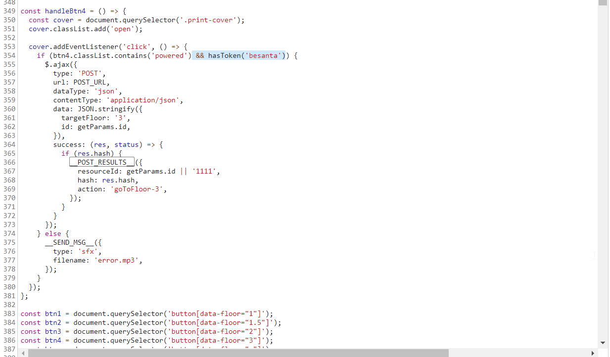
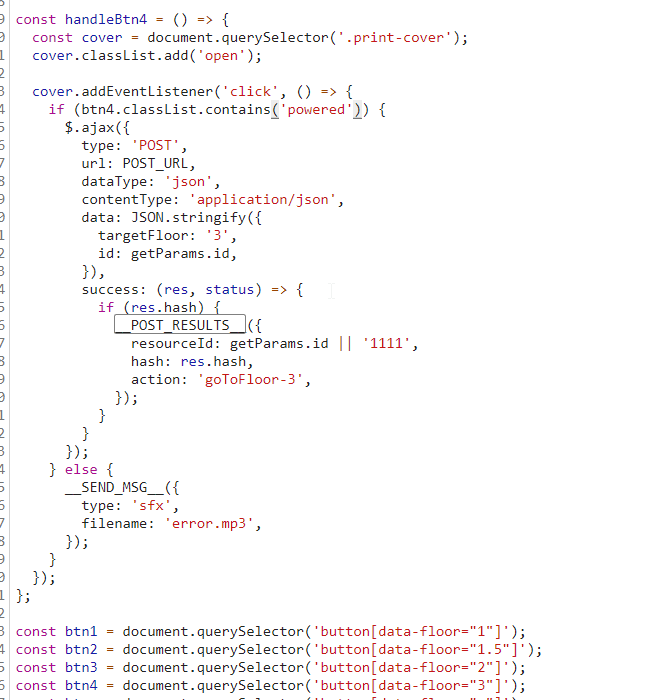
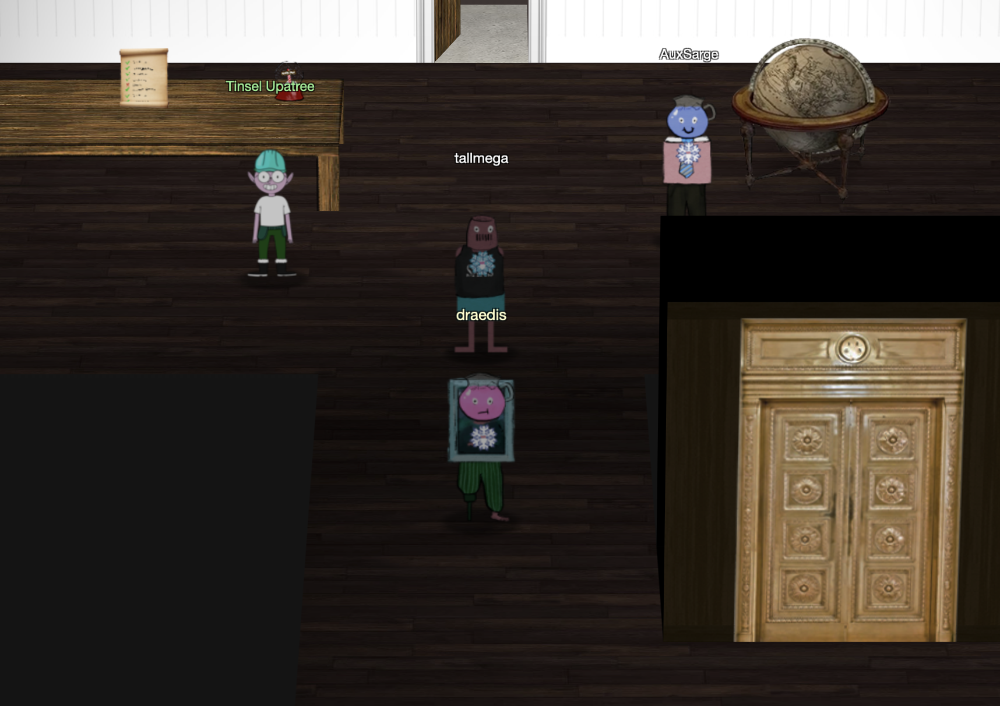

# Operate the Santavator Without Fingerprint
The objective if this challenge is to bypass the fingerprint scanner in the santavator to gain access to the workshop as the regular player character. This challenge is solvable by inspecting the source code of the santavator zone which reveals the check on the finger print reader is enforced client side. By modifying the source code in the browser, the check can be removed allowing a bypass to access Santa's office.
## Enumeration
First, in the narative of the game, using the santavator with authorization demonstrated how a normal flow occurs. The user, with authorization, clicks the button for Santa's Office then clicks the fingerprint reader. Therefore, the goal is to bypass the authorization that occur when the finger print reader is clicked.

Knowing this, the click handler code can be found by tracing the element in the website's DOM through to the Javascript. After doing this trace, the code which executes the click handler can be isolated as seen below.

## Bypassing
Inspecting the code, there is a call to `hashToken('santa')` in an if block which is likely the authorization event. This would indicate the authorization is occuring client side. It is possible then to modify the running javascript in the bowser and remove this check. This functionality is available in standard Chrome and Firefox developer edition. The screen shots below show the modification in Chrome.

After modifying the source, the finger print will reader will grant you access to Santa's Workshop as the regular user.

