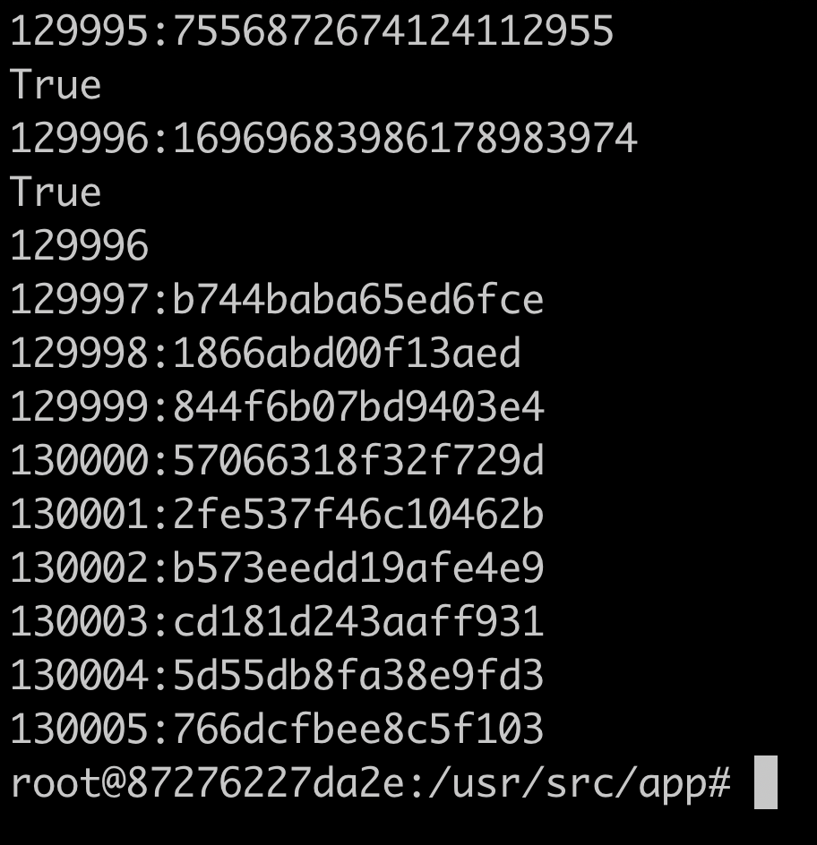
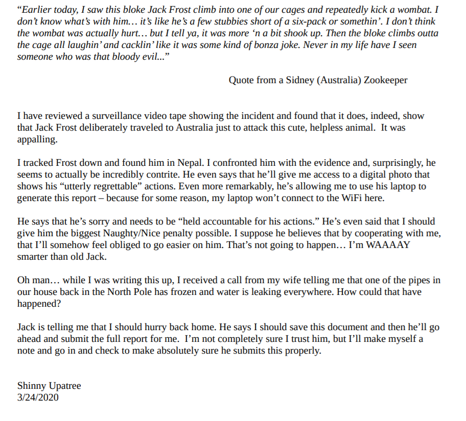
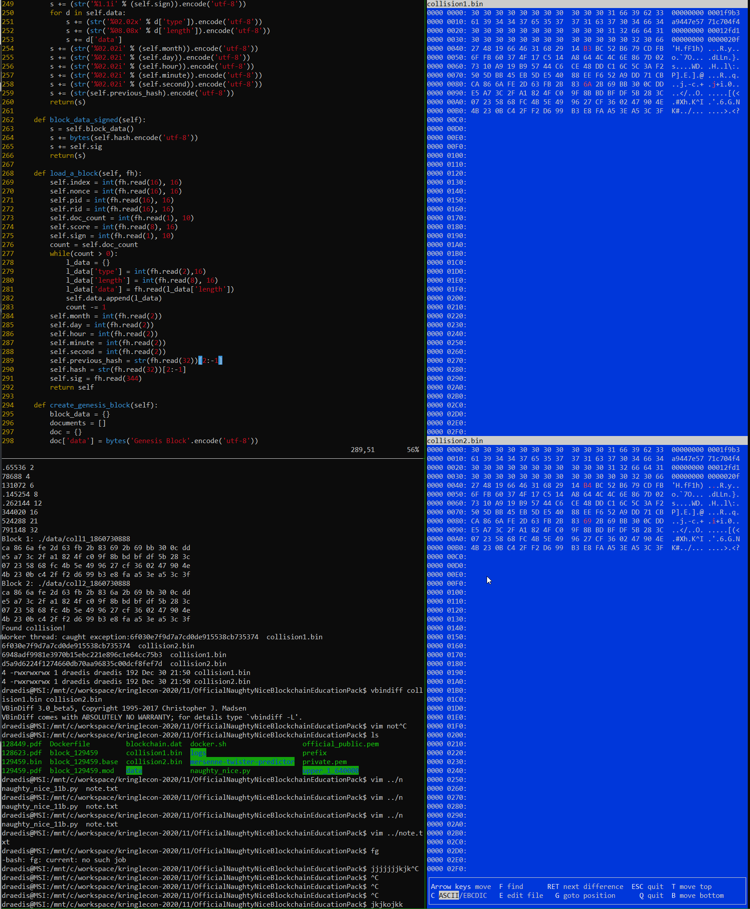
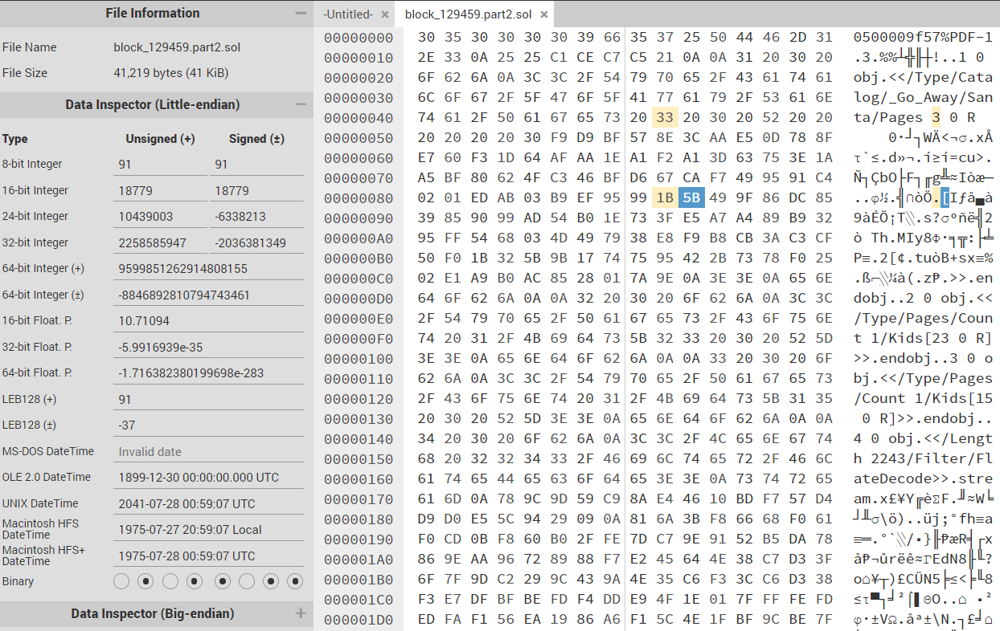
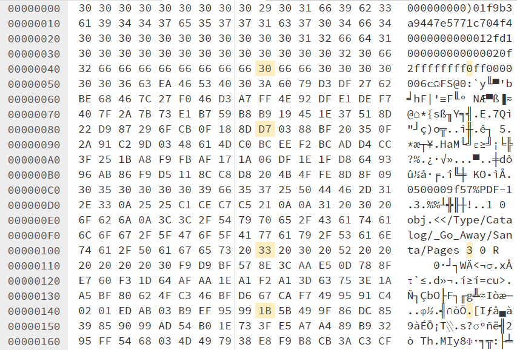
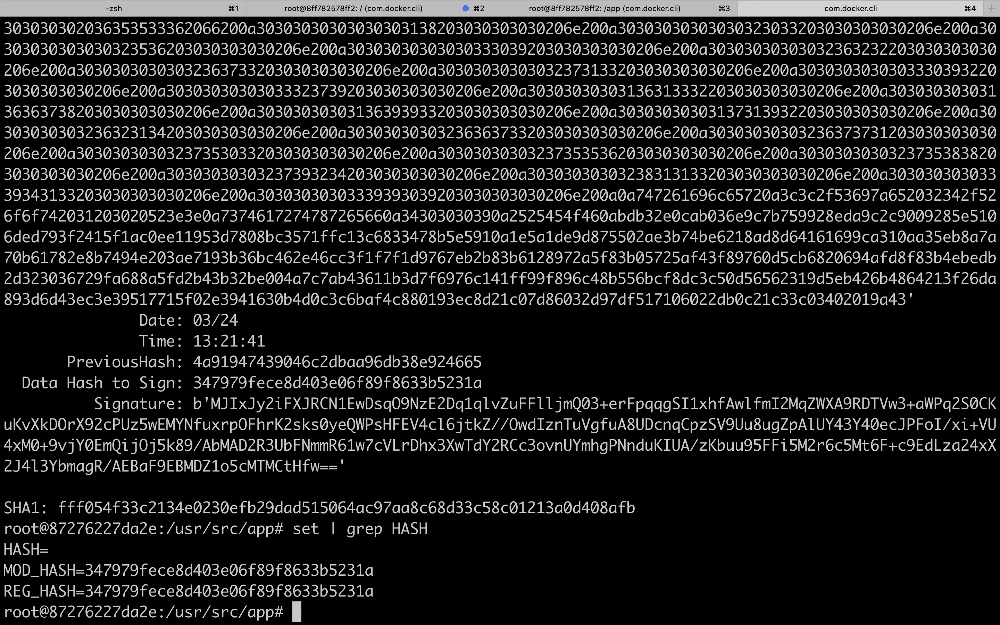

# Objective 11 - Naughty/Nice List with Blockchain Investigation
This challenge entailed performing various tasks on the naughty or nice blockchain. It was broken up into two parts. The first part required using the cryptographic weakness in the mersenne twister random number generator predict the nonce values used in blocks. The second part required undoing an MD5 hash collision induced in one of the blocks to recover the original information. 
## Part 1 - Nonce Prediction
The nonce generation code is handled by sample python code `naughty_nice.py` which reveals it uses the built-in python random number generator which is based on the mersenne twister algorithm. This algorithm has a weakness for cryptographic applications in that, with 624 observed sequential generations, a model and be populated which will then be able to generate all future values. Within the naughty / nice blockchain, there are exactly 624 sequential nonce values which can be used to prepopulate model and predict what future nonce values will be.

The script, `naughty_nice_11a.py` solves this for the `blockchain.dat` file by reporting the the next 10 values of the nonce based on the predictor. This allows the prediction of the nonce for index 130000 to be predicted and submitted.

```python
from mt19937predictor import MT19937Predictor

    pd = MT19937Predictor()
    pass_i = 0 
    i = 0
    for b in c2.blocks:
        print("{}:{}".format(b.index,b.nonce))
        pass_i = b.index
        i = i + 1

        if i > 624:
            print(pd.getrandbits(64) == b.nonce)
        else:
            pd.setrandbits(b.nonce,64)
    print(pass_i)

    for i in range (1,10):
        print("{}:{:x}".format(i+pass_i,pd.getrandbits(64)))

```



## Part 2 - Undo MD5 Collision
### Finding the Tampered Block
In part, the first step is to use the provided hash to find the block within the chain that was tampered with. The SHA1 hash of the block is `58a3b9335a6ceb0234c12d35a0564c4ef0e90152d0eb2ce2082383b38028a90f`. As describe in the question, this is the SHA1 of the whole block, not the data section which the suspect MD5 hash encompasses. Therefore, to find this hash, the SHA1 of the whole data block needs to be done and compared against the known value. THis can be done with the following code snipit below, appended to the end of the `naughty_nice.py`

```python
import hashlib
h = hashlib.sha256()
hv = '58a3b9335a6ceb0234c12d35a0564c4ef0e90152d0eb2ce2082383b38028a90f'
c = Chain(load=True, filename='blockchain.dat')
for b in c.blocks:
    m.update(b.block_data_signed())
    if m.hexdigest() == hv:
        print(b.index)
        break
```

After running the code, we find the block to be 129459
### The Hints
The hints for this challenge revealed the following which will dictate the plans moving forward.
1. A collision was in the MD5 signature was induced
    * This block is the tampered version, need to undo it
    * This collision type is UniColl
2. The tamper only required 4 bytes to change within the block
### Block Enumeration
Now that the tampered block has been revealed, it can be surveyed to to see what areas might be of interested in assessing for the 4 byte changes.
#### Areas of Interest
1. fields
    * Score
        * Set to 0xFFFFFFFF, the max for the 4 byte data type of this field
    * Sign (Naughty/Nice)
        * Set to 0x01, interpreted as nice
        * Any < 0x01 value of this will be interpreted as naughty
    * Attachment 1
        * Binary Blob
        * Extracted but found not determine a file type
    * Attachment 2
        * PDF File
        * Extracted and viewed
        * Noticed the file size was noticeably larger than other PDF files pulled ouf the blockchain

Without some more research into MD5 collisions
### MD5 Collision Research
Following the reference material provided as the hints, the following observations where made.
1. UniColl can be done with 2 byte changes involving a modification of +1 and -1 at 64 byte clock aligned byte positions
2. An identical pretext collision (IPC) is likely used since when looking at the file structure of the block, the first 64 bytes are unlikely to be modified in the tamper event
3. A PDF UniColl only requires 2 byte changes and can be used to render two PDF with different contents
    * Two PDFs are merged together
    * Main catalog in one points to one document tree and second PDf the other document tree
        * This change this the first byte modification UniColl requires
    * Second byte modification falls in a comment block after the catalog
#### Reference Material
* [Hash Collisions](https://github.com/corkami/collisions)
* [Hash Clash Tool](https://github.com/cr-marcstevens/hashclash)
* [Hash Collisions Presentation](https://speakerdeck.com/ange/colltris)
### Analyzing the PDF
The first byte to attempt to swap based on the research is the page number in the catalog, moving from page 2 to page 3. In so doing, the PDF, when opened through chrome renders a completely different file content. They can be seen in the screenshots below.


Reading the contents of the PDF, the next byte modification within the block becomes apparent, the sign (naughty or nice) field was moved from 0 (naughty) to 1 (nice).

At this point, we have 2 of the 4 byte modifications. Block byte 0x49 was modified with a +1 and block byte 0x109 or PDF byte 0x3F was modified with a -1.
### Block Byte 0x49
Some observations about this byte.
1. Its at the 9th position in the second 64 byte block, which is a characteristic of the UniColl attack
2. The byte is increased by 1 in the attack which aligns with the UniColl style attack.

Using the above observations, it seems likely that this byte modification is the result of a UniColl with an identical prefix for each block. The prefix is the first 64 bytes, which is the first 4 fields of the block:
Index       [0-15]
Nonce       [16-31]
Pid         [32-47]
Rid         [48-63]
Then, he modification block would see the 9th byte of the block be modified by a + 1.
doc_count   [64]
score       [65-71]
sign        [72] //0x49

A test with the prefix was done with [hashclash](https://github.com/cr-marcstevens/hashclash) which is seen in the screenshot below.


Thus, based on the analysis, the next byte to modified occur at 0x89, (64 bytes later). This byte occurs within the unidentified binary blob attachment to the block. Thus, this attachment is likely a "comment" section within the hash collisions view of the file format in that the data can be modified without affecting the file interpretation. The byte at 0x89 would have been decremented by 1 by the attack. Therefore, to "correct" this block from what is currently on the blockchain, byte 0x49 needs to be decremented by 1 and byte 0x89 needs to incremented by 1.

Running through through the modified python code of `naught_nice.py`, the MD5 hash is the same. This indicates that collision in the PDF file is independent of the collision induced two move the bytes in block data areas. In the UniColl theory, this is because this is considered the suffix of the hash representation of the file format and can be any data. It also means that the byte modification in the PDF can be stand alone and not part of any hash collision.

### PDF Byte 0x109
This byte is required to be modified to reveal the hidden PDF within the document. This makes 3 identified bytes with one more left to discover. As indicated in the previous section, this byte modification is independent of the MD5 hash collision of the whole block and thus the third byte can be anywhere within the suffix of the initial collision. However, it is likely, given the challenge, the byte change in the PDF to hide the non-malicious PDF are related through a hash collision. Looking at the dumped PDF document (`block.dump_doc(1)`), the modification of the known byte occurs at 0x3F, which is not properly byte aligned for the UniColl exploit. Examining the file structure on disk again, it can be observed that the file storage format on the blockchain, pushes in 10 bytes, identifying the file type and size which would make it the aligned for a UniColl exploit. Furthermore, the second byte change at offset 0x89, would fall in the PDF catalog comment section which is what an attacker would want in a UniColl exploit on a PDF file. Thus, it appears that a second collision was created in the raw data format of attachment: [2 Bytes - Type][8 Bytes - Length][PDF File]. Thus, if the attacker attempted to hide this change in a hash collision, it would indicate that the 0x89 byte would need to be decremented by 1. The following changes were made.


Now, the final block can be reassembled as seen below.


## Final Test
Now with the newly assembled, the block the MD5 can be verified and the SHA1 taken.

