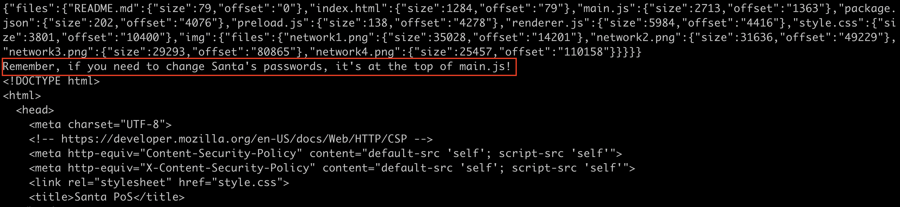

# Objective 3 - Point of Sale
This challege is about extracting a secret from an election appliaction which is provided as part of the challenge.
## Enumeration
The file is provided for analysis from the challenge. It is a PE file named `santa-shop.exe`. It can be extracted to see it's contents using p7zip on a mac.
```bash
mkdir santa-shop
cp santa-shop.exe santa-shop/
cd santa-shop.exe
7z x santa-shop.exe
```
The resulting file structure makes it look like the application is an electron contained in the file, `app-64.7z` witin the unziped `$PLUGINS` directory.

```bash
cd \$PLUGINS
7z x app-64.7z
find .
```
## Investigating the Electron App
Now that the app has been decompressed, secrets can be looked for in the application. The electron application is contained witin the app.asar file within the resources directory. Steping through this file via via strings, the password can be discovered.
```bash
strings resources/app.asar | less
```

