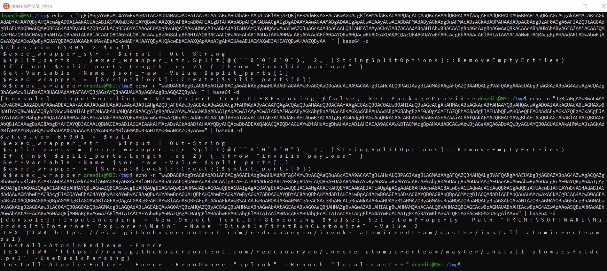
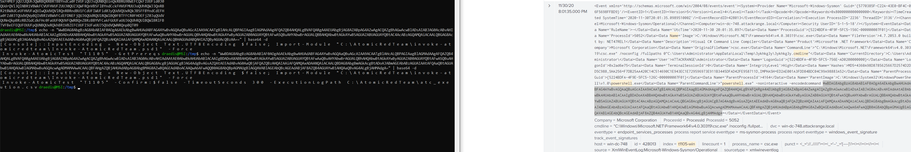
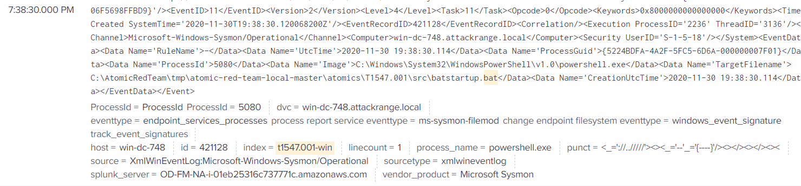
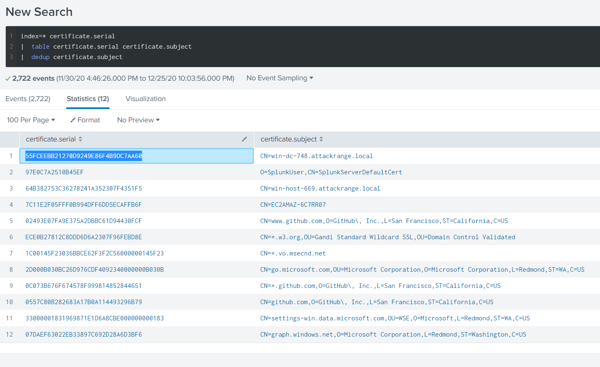

# Splunk

## Question 1 - Total Unique ATTACk Techniques
Run the specific splunk query to get the list if indexes. Copy and paste the results to a text file and use unix command line tools to process the data to the correct answer.

```splunk
| tstats count where index=t* by index
```
Copy and paste these results into rs.txt
```bash
cat rs.txt | awk '{print $2}' | cut -d - -f 1 | sort | uniq | cut -d '.' -f 1 | sort | uniq | wc -l
```
### Answer
13

## Question 2 - Two Indes for Technique T1059.003
Just read the data from the splunk query results from question 1.
### Answer
t1059.003-main t1059.003-win

## Question 3 - Retrieve Data About Technique for `System Information Discovery`
Need to go through the list of emulate attacks for figure out which one this is. Using [Atomic Red Team](https://github.com/redcanaryco/atomic-red-team) to resolve the names.
* T1033 - System Owner/User Discovery
* T1057 - Process Discovery
* T1059.003 - Windows Command Shell
* T1059.005 - Visual Basic
* T1071.001 - Web
* *T1082 - System Information Discovery*

Now, we can search the index.

1. Get a layout of the underlying data structure by selecting all from the index
```splunk
index=t10982-win
```

2. Query the data set for the term `MachineGuid` then look at the command lines which use the registry
```splunk
index=t1082-win MachineGuid |  stats count by cmdline
```

### Answer
HKEY_LOCAL_MACHINE\SOFTWARE\Microsoft\Cryptography

## Question 4 - When was the First OSTAP Test Executed
Search for OSTAP in Atomic Red Team, we see it is mentioned in T1105. Searching the index list, we have indexes for 1105 main and win.

1. Get a view of the data in the two indexes with a blank search
```splunk
index=t1105-*
```
The tests must be executed, so looking at the running processes, powershell becomes a likely suspect given MITRE red team tests are involved so simple languages like cmd.exe are not well suited.


2. Refine the Search for only powershell
```splunk
index=t1105-* cmdline powershell 
| sort Time 
|  reverse
```


3. Find Tests
Looking through the results, the 4th event down is a powershell invocation using base64 script body, often times used in powershell bypasses. This seems like a likely candidiate. Grab the payload and look at it. Start stepping through the encoded payloads. It starts to become clear invoke-powershell is being used to execute these tests. Therefore, we need to find the actual invokation of the test. Somethinglike Invoke-Atomicds T1105

The invocation was discovered shortly after


**Well none of this worked**
Over thought it as per the hints. They maintain an index which is where they want the answer from. The answers determine above however can technically be correct depending on the definition of when the tests are started.

### Answer
2020-11-30T17:44:15Z

## Question 5 - Whats the Process ID of the use of WindowsAudioDevice-Powershell-Cmdlet
Firts find the index this data is in the same as question 4. Looking at the specified [user's github](https://github.com/frgnca?tab=repositories), there is only one that seems to be likely to be used, `AudioDeviceCmdlets`. Looking at the Atomic Red Team repository, we find T1123 is an audio capture test and it is present as one of the indexes in this test suite. It is likely that this is the test the question is about. 

### Answer
3648

## Question 6 - Whats the Batch File Run via Run Keys
Need to figure out the technique which abuses registry run keys. Continuing the list from question 3.
* T1105 - Ingress Tool Transfer
* T1106 - Native API
* T1123 - Audio Capture
* T1204.002 - Malicious File
* *T1547.001 - Registry Run Keys / Startup Folder*

Start hunting the batch file
```splunk
index=t1547* bat
```

Likely the file we are looking for to refine the query


Well that didnt work. Went about it a different way.

Any batch file included has to be part of the test repo. So, going to the test and looking at the markdown files, looked at each one for the run keys tests. Only found one wich used a batch file. Went the patch file and entered the data which was correct.
### Answer
quser

https://github.com/redcanaryco/atomic-red-team/blob/master/atomics/T1547.001/T1547.001.md#atomic-test-3---powershell-registry-runonce

https://raw.githubusercontent.com/redcanaryco/atomic-red-team/master/ARTifacts/Misc/Discovery.bat
## Question 7 - 


### Anser
55FCEEBB21270D9249E86F4B9DC7AA60

## Final Question
Provided cipher text and the algorithm which needs to be cracked.

Base64 Encoded CT: `7FXjP1lyfKbyDK/MChyf36h7`
Alg: RC4

The RC4 password is included in the end of the Kringlecon 3 talk Adversay Emulation and Automation.

## Answer
The Lollipop Guild


