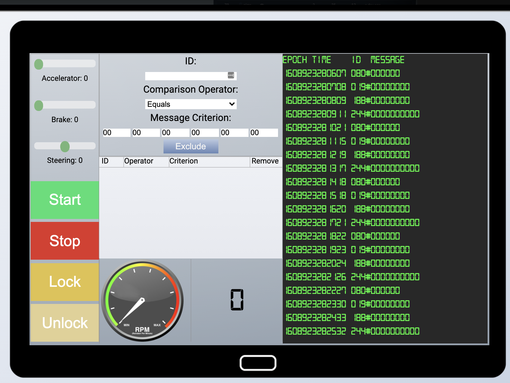
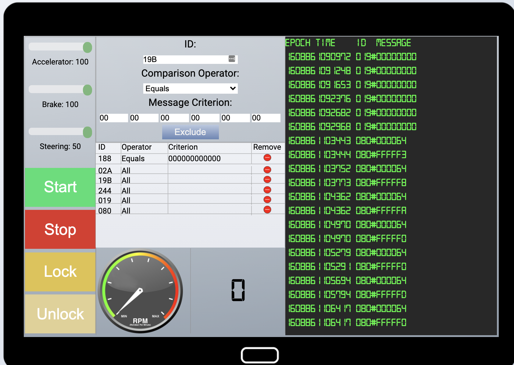
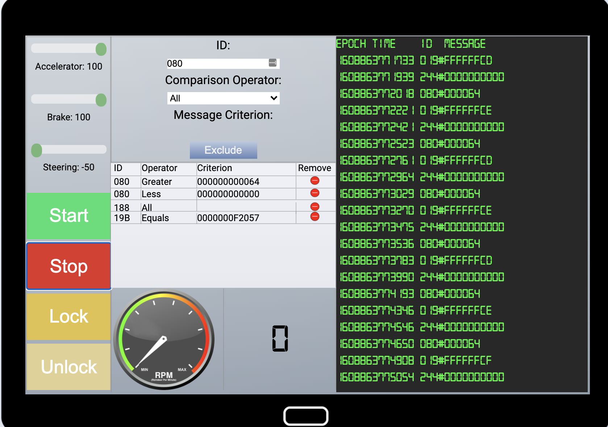
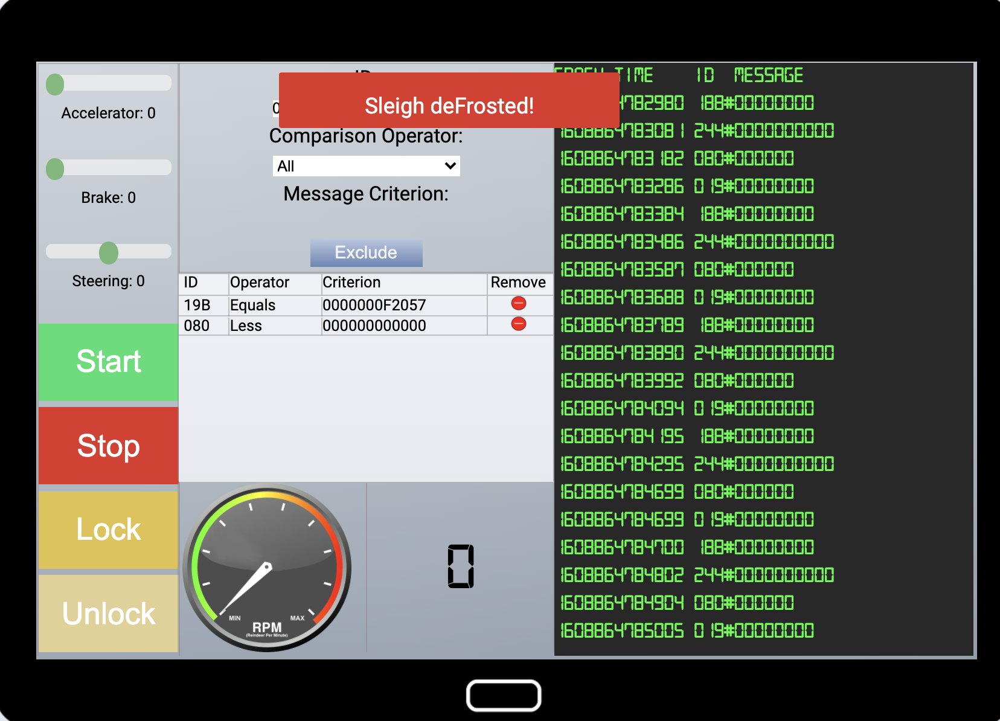

# Objective 7 - Solve the Sleigh's CAN-D-BUS Problem
This challenge revolves around sifting through CAN bus signals on Santa's sleigh and filtering out extraneous ones which are potentially malicious. The challenge requires investigation of each signal to determine its function and after that has been done, filtering out all others.
## Approach
The initial UI has scrolling signals messages with their data payload. The signals format are: `time SIGNAL_ID#SIGNAL_DATA`. The filtering mechanism provides a way to match signals and their payloads. This can be all data, specific data or data greater than or less than the specified value. The console also provides several operational buttons which will modify the signals to control the sleigh.

## Strategy
The overall strategy will be as follows:
1. Identify each signal by isolating every signal until the console is not scrolling
2. Determine each signal's purpose by looping in 1 and testing which control exercises that signal
    * Test the bounds of the signal when applicable
3. Once all signals are identified, remove the unknown signals via the filter

## Results
Testing through, signal was assessed.

### Helm Controls
#### 019 - Steering
This signal has range [-50:50] for left and right respectively. In testing, it shows that the decimal values for the data payloads are signed, 2's compliment for negative value. The data type is 6 bytes long.
#### 080 - Brakes
This signal handles the breaks with a range [0:100]. In testing, the brakes, an additional periodic signal from the brakes as observed which appears to be the opposite the true signal. The true signal was determined by matching the control tunning value to the signal payload value. This value, being the opposite (e.g. if its 10, then the phantom signal is -10), cab be removed by enforcing the bounds of the true value for the signals of the range [0:100]. Therefore, a filter is needed to remove signal values less than 0x00.
#### ??? - Acceleration 
No direct signal as observed for this. It is related to the RPM signal but it does not represent this.
### HUD
#### 244 - RPM HUD
The RPM display is feed by signal 244. Nothing special observed here. It is influenced via the helm controls, most noticeably, the accelerator.
### Controls
#### 02A - Power
Signals for the power controls are easily determined because they are not periodic messages, rather discrete messages. They can be generated by turning the sleigh on and off. In this testing, there was nothing special identified with 
#### 19B - Locks
Signals for the locks, like the power controls are easily determined because the controls trigger discrete events rather then streaming information. In looking, the signals for locking and unlocking of observed however a periodic signal can be seen with data payload 0xF2057. In testing the controls, there was no way to influence this signal. Likely, this is a bad signal and should be removed. A filter is assigned which matches the signal ID 0x19B and payload 0xF2057.
### Unknown Signals
#### 188 - ???
An unknown signal of ID 188 is seen periodically broadcasting the payload value of 0x00. None of the controls where found to assert any influence on the frequency or the value of the signal. It has been flagged as malicious signal and a filter applied for its ID and all values.
## Filter Set 1 - Failure
* 188 - Remove All
* 18B - Remove value 0xF2057
* 080 - Make sure value is > 0x00 and < 0x65

The above filters did not solve the challenge.

## Filter Set 2 - Some Help In Refining - Failure
After this did not work, the signals were all double checked and the results validated. So, the in-game hints were sought out which focused the the light on two specific areas, the brakes and the locks. Having already verified the signals in the noise, it out seem that the unknown signal 188 might not be malicious in nature and should be removed from the filters. This was done, but no success
* 18B - Remove value 0xF2057
* 080 - Make sure value is > 0x00 and < 0x65
## Filter Set 3 - Technically Correct
Rechecked everything again the filter should be correct. Started looking over discord looking for any potential hints about what the issue would be. One such hint was something like `make it as simple as possible`. The 18B signal seemed to be no simpler, so maybe there was something else involved in the brakes signal 080. After retesting, based on the malicious signal being seen, the filer COULD be simplified by only removing negative values. Removing the upper bound filter, the challenge is passed.

So, the second try should have succeeded because it enforced the correct filters. From a security perspective, this is the correct answer. It enforces a whitelist of values for the signals rather than using a blacklist for known bad signals.