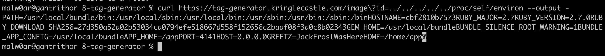
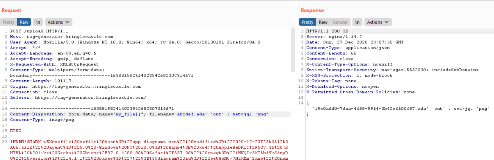

# Objective 8 - Broken Tag Generator
The tag generator is a web app where the challenge involves looking for a specific environment variable and obtaining the value. This challenge has multiple ways to solve. In this document, two will be explored. Direct exposure via a directory path traversal allowing local file inclusion vulnerability and via command injection which allows remote code execution.

## Enumeration
Based on the challenge description, it became clear that this would involve web app pentesting. Thus, burp was used in non-intercept mode to enumerate the web app passively while the web app was explored manually. The tool allows the user to upload an image, do some basic editing then host the result. After the enumeration, two endpoints became interesting

```GET /image?id=``` and ```POST /upload```.

Various files were tested uploading to the site and the results were monitored via burp to profile the behavior. Some observations from the initial testing are listed below.

1. Can only upload png files (file extension checking)
2. Uploaded files are renamed and accessed via the `image` endpoint with a seemingly random guid file name
3. Invalid file names reveal the web app source location


## Testing for Directory Traversal
### Upload
The filename parameter is user controllable (along with the contents of the file). Testing to see if directory traversal was possible by using `../` within the filenames however after some testing, it became apparent there is no way to test if this worked. The headers of the webserver indicate nginx however, due to the information disclosure from the error message, the app is known to be ruby which would have a different header usually. Likely, nginx is configured to proxy requests to the ruby webserver running locally. In testing the directory taversal, attempts were made to write output to nginx default locations (e.g. `/var/www/html`...) but were never able to be retrieved.

### Image
The image endpoint takes in the `id` parameter which points to the image file in the format `guid.png`. It is possible, given the id's are ending in `.png` that the function is looking in a directory. Passing on a usual test for directory traversal `../../../../../../etc/passwd` shows that it is susceptible to this vulnerability and is exploitable in the form of a local file inclusion (LFI).


### Exploiting the LFI
The passwd file exfiltration is proof but not helpful in advancing the objectives. The shadow file was attempted which was unsuccessful. Using information from the enumeration stage, the app's main code `app.rb` was attempted to be exfiltrated and was successful. It can be viewed [here](app.rb). 

## Examining the Code
Doing static analysis on the source code, important information and vulnerabilities were discovered. They are listed below.

1. There is a command injection vulnerability in the `/upload` handler in the `filename` parameter. Data constructed from this data is passed to `system` and may be exploitable.
2. `/upload` allows zip file to be uploaded and checks for special characters in filenames, specifically `.` are commented out. Files may be able to be uploaded to arbitrary locations on the filesystem via a directory traversal vulnerability depending on the way the ruby zip library handles relative file names.

## Re-examining the LFI
After reviewing the goals, to disclose a specific environment variable it seemed possible to do this with just and LFI. The `/proc` directory on the filesystem holds all the runtime and environment information for all the running processes including the one the LFI is executing in. Within `/proc` there is a link to the currently running process, `/proc/self` linking to the proper pid. Within each pid folder, there is an environment file, `/proc/self/environ`, which has all the environment variables defined for the running process. The contents of this file can be retrieved to solve the challenge.


The value of the environment variable is `JackFrostWasHere`

## Extra Credit
### Trying RCE
Looking at the command injection vulnerability, it looks that some portion of the input to a `system` call is user controllable. In testing, it was discovered that the portion of the filename starting at the `.` in the file extension. Furthermore, the file extension appears to be checked if it is a `png`. Code analysis shows this constraint is not true, but appeared to be during testing against the production web app based on the responses. Furthermore, code analysis shows the command injection is blind. However, coupled with the LFI, results of commands can be piped to a file and pulled down later.

Testing against the production web app proved difficult to construct and debug an appropriate payload. Thus, using the LFI, copies of the files needed to run the app were pulled down and a test environment was built inside [docker](rce/Dockerfile). This environment instrumented the code to get additional debug information to help build the payload. After much testing, a payload was constructed which would trigger the command injection. using the command `set>jg`, the environment was dumped which would yieled the environment variable described in the goal. This also showed where the file would be generated (`/tmp`).




### Trying Zip
Based on the source code, there is a potential zip directory path traversal vulnerability in the code. The first step was to verify if the zip library processed relative paths. It was done as described below.
#### Testing
Used ubuntu docker, the likely victim machine. Created a sample zip file using relative file paths (../var/www/html) to attempt tp plant web shell in the nginx web root. Required additional flags to unzip, `unzip -:` to make it respect relative paths. This would need to be tested in the ruby app.

Sample ruby app mirroring the zip handler seen in the leaked source code to build to test its handling of relative zip file paths (`temp.rb`). In testing, it was found to respect relative paths.

```bash
# setup env
docker run -it --rm -v $(pwd):/tmp ubuntu bash
apt update
apt install nginx ruby zip -y
/usr/sbin/nginx

# setup malicious zip file, payload is not important now
cd /tmp
touch /var/www/html/shell.php
zip images.zip .../var/www/html/shell.php

# install ruby reqts
gem install zip rubyzip

# run the test app
ruby temp.rb
```
### Exploiting
Now the vulnerability is proven, a method for exploiting it needs to be determined. The target appears to be running an nginx web server which is hosting the web app. However, in enumerating as much as possible via the LFI, not location where a shell could be uploaded to where nginx serves from could be established. As discussed earlier, ngnix is likely being used as a proxy for the ruby WEBrick webserver. Next, an erb based web shell was tested. Given the web app will only load fixed views, the web shell would need to overwrite an existing one. However in testing, this proved not possible. Next, the views referenced in the `app.rb` were pulled down and examined for a way to include to the additional view or for server side template injections (SSTI) which could be used to execute remove code. None was found.

The most useful thing that can be done via this vulnerability is to upload a reverse shell then trigger it via the RCE.