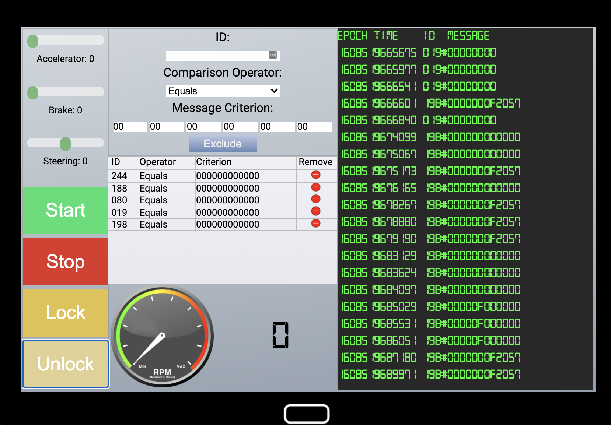

# Can-Bus
This challenge requires assuming Santa's identity to be able to access the sleigh which allows to isolate the signals for lock and unlock events.
## Reduce the Noise
At the sleigh, it is scolling can bus events. The console gives the ability to add filters to remove messages. The buttons on the left hand side give the ability to trigger discrete events for lock and unlock indicating they are not regularly scrolling data (due to being discrete input events). So, just start adding filters based on what we see scrolling on the screen. Keep adding filters until the screen is barely moving at all (if not completely stopped). At this point, it will be easy to observe the lock and unlock events. Toggle the buttons a few times to see the signals appear in the event log.



Once we record the events for the lock and unlock events:

```
# lock
19B#00000F000000

# unlock
19B#000000000000
```

It be comes trivial to grep the log for these two events and extract the decimal portion of the time and submit to the answer receiver.