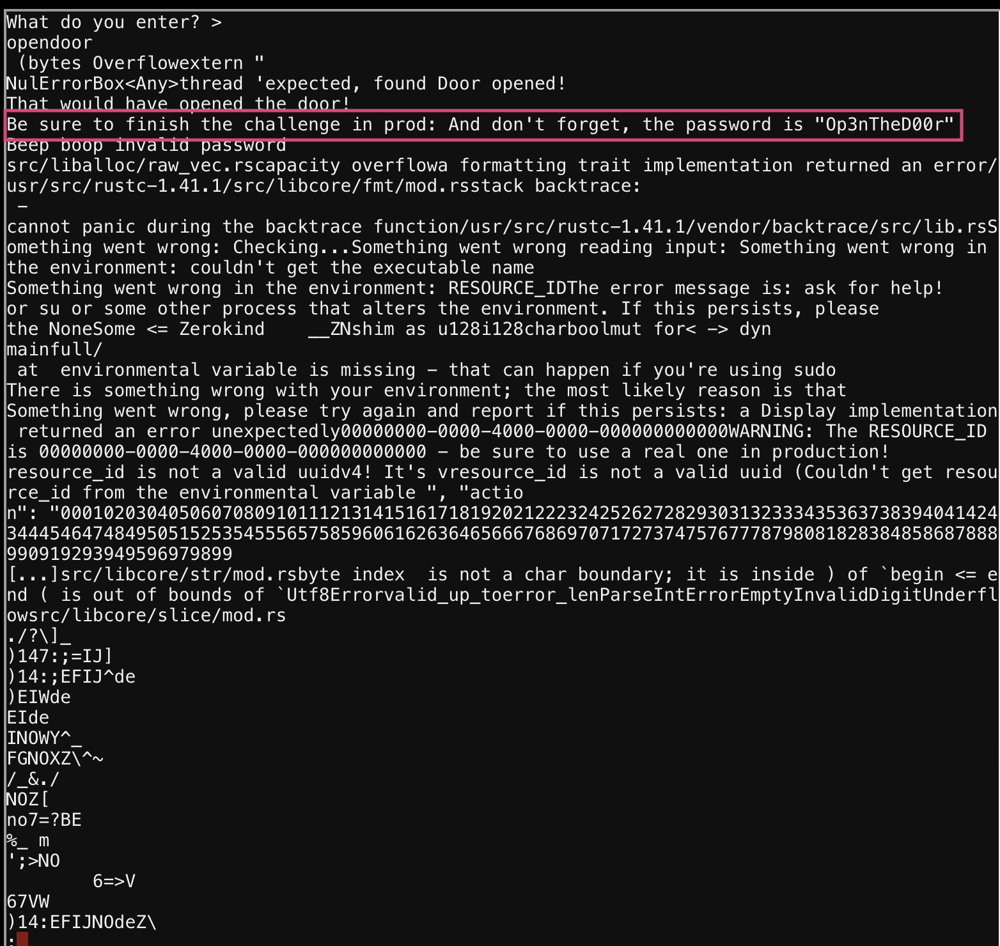
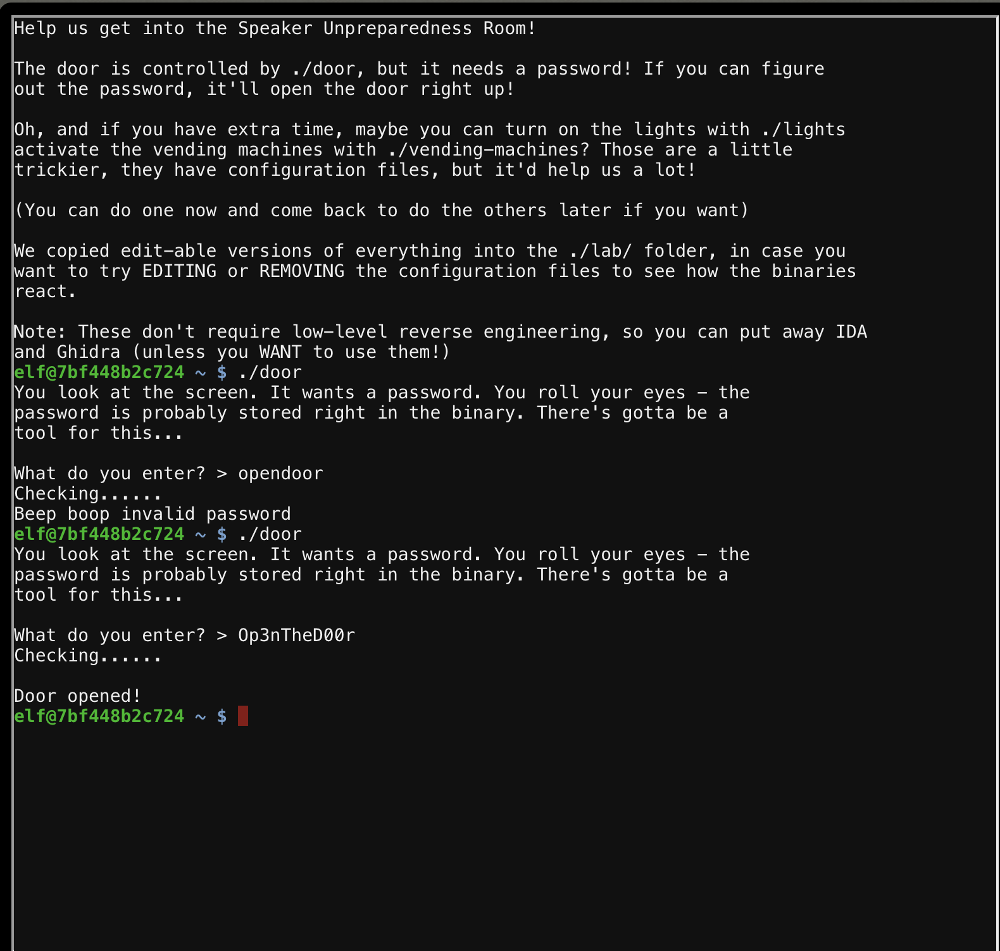

# Door Reverse Engineering
In this challenge, a binary (door) is presented in the termincal which requires figuring out the password. The binary is a rust binary.
## Reversing
One if the first techniques in reversing is to look at the strings in binary via `strings`. In so doing, a password is revealed that works on the to solve the challenge.
```bash
strings door | less
```

