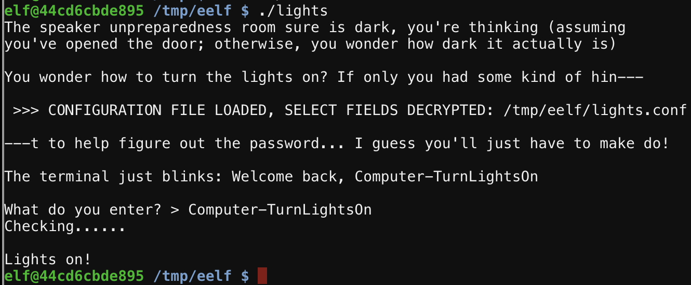

# Lights Reversing
This challenge required the reversing of a `lights` binary which asked for a password. The configuration file was provided as well which had an encrypted password and a username.

```bash
password: E$ed633d885dcb9b2f3f0118361de4d57752712c27c5316a95d9e5e5b124
name: elf-technician
```
The first observation about the `password` field is the format `E$<SOME VALUE>`. This looks like the way hashes are stored so likely the `E` means encrypted and the `$` is a delimiter. Thinking this was a hash, this value was placed in `hash-identifier` which yielded no results, so its not a known hash.


Next, looked at the actual binary running and see it does infact read the configuration file, presenting the username and asking for a password.


The elf mentioned that here is a lab folder which can be used for testing. At the timel it was unclear why this was necessary. Diffing the binaries and the configs the files where the same. Attempting to run it yielded the same results too. The only decernable difference being the config file loading location. It is likely tied to the directory the binary resides in.


Next, it looks like we can manipulate the file, so lets try stripping the encryption from the config file. First, lets try something like `P` for plain text, then removing it all together. In testing, by removing it we could pass in the encryped value. Likely, the lack of `E$` prefix causes the program to treat the field as plaintext.


Attempting the binary indicates that this needs to be run in the main directory to pass. So, in attempting the same bypass on the main binary we find why the lab folder exists. The configuration file is not modifiable. So the next step was to try and find a way to control which config file gets loaded by the binary. The following where tried

1. Manipulating the environment to make it look like the `lab` folder was the current directory and home directory
2. `strings` out the binary looking for any potential environment override to point to a new config file.
3. `strings` looking for hidden argv's to pass in
4. chroot to a new environtment (no sudo access)

Looking at the binary, it has the name `/home/elf/lights` hardcoded into it, likely used to identify if the image loaded is the correct one. This can be patched in the the binary mode, which worked, but as I found out later, was not the correct solve, but its shown here.

## Bin Patch
Patch the binary to point to a new directory layout. The new path will need to be the same length as the hardcoded value in the binary (`/home/elf/lights`). This can be done by selecting  the replaced `/tmp/eelf/lights` which uses the writable tmp directory.





Needed a hint here on what to do next, but really had all the information needed to deduce the next logical step. 

1. Established in the first attempt that by removing the `E$` from the password field made the program treat it as not encrypted.
2. Vaguely aware that the username is also read and printed on the screen as well.

## Mistake!
Made the bad assumption that only the password field could be treated as encrypted.

What we can do is put the encrypted value in for the username in the labs directory in an attempt to have the program print the decrypted version in the standard output of the program. And that is found to work.


Entering the value into the binary works in both the lab and production environments.