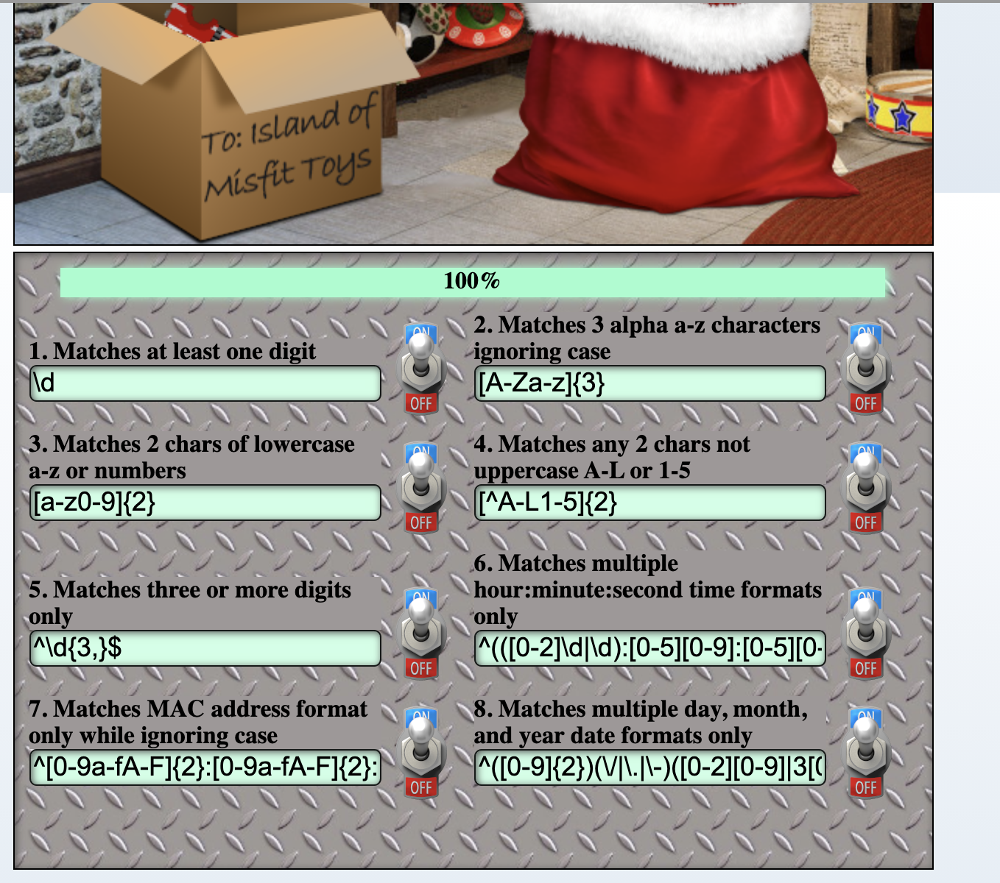

# Sort-o-matic
This challenge is all about writing regexps based on the provided questions. If you click on the name, it will provide sample input to be accepted and sample output to be rejected. (Took too long to realize this). Furtermore, the words, (something like) 'use anchors and word boundries to remove extra data from the match' means they want start of string `^` and end of string `$` anchors on the match.

## Digit
```\d```
## Create a Regex That Matches 3 or More Alpha Characters Ignoring Case
```[A-Za-z]{3}```
## Create a Regex That Matches Two Consecutive Lowercase a-z or numeric characters.
```[a-z0-9]{2}```
## Matches any 2 chars not uppercase A-L or 1-5
```[^A-L1-5]{2}```
## Create a Regex To Match a String of 3 Characters in Length or More Composed of ONLY Digits
```^\d{3,}$```
## Create A Regex To Match Multiple Hour:Minute:Second Time Formats Only
```^(([0-2]\d|\d):[0-5][0-9]:[0-5][0-9])$```
## Create A Regular Expression That Matches The MAC Address Format Only While Ignoring Case
```^([0-9a-fA-F]{2}:){5}[0-9a-fA-F]{2}$```
## Create A Regex That Matches Multiple Day, Month, and Year Date Formats Only
```^([0-9]{2})(\/|\.|\-)([0-2][0-9]|3[0-1])(\/|\.|\-)(19|20)[0-9]{2}$```
## Success
