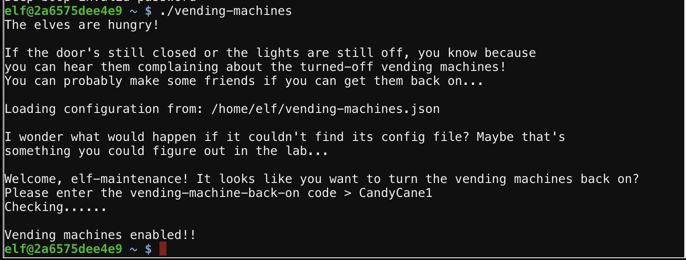

# Vending Machine Reverse Engineering
This challenge was much like the challenge for the lights in that a configuration file with an encrypted value was present and the encrypted value needed to be determined. Unlike in the lights variant, there was no 'switchable' configuration value which could be used encrypt and decrypt known values. Furthermore, doing simple binary patching was tested (as done in lights) but this was not possible as the string appeared to not be hardcoded as one entity within the binary.
## Initial Testing
In the lab directory, a non-write protected variant of the code was presented which allowed the modification of the configuration file. In testing, it was discovered that if there is no configuration file, the binary would prompt the user for a username and password and generate a new one. To test the potential encryption mechanism, inputs where entered and patterns emerged. The most important pattern was that it was **deterministic encryption**. That is, the same plain text always yeileds the same cipher text. This allows us to build and electronic code book and map the input to encrypted output. This code book can then be used to decrypt the value within the json configuration file.
## Approach
Due to automation, it was acutally less complex to just brute force it (much less intelligent) than to construct the code book. The basic algorithm was this.

### Pseudo Code
```
encrypted_pw = "LVEdQPpBwr"
decrypted_pw = ""
for i in len(password)
{
    for all printable ascii characters as char
    {
        partial = encrypt(decrypted_pw + char)
        if partial == password[0:i]
        {
            decryped_pw = partial
        }
    }
}
```

Getting even lazier in doing this (because I was doing other stuff at the time as well, like you know, work), I just ran this manually in success as some bash scripts below. The values are feeded as standard input to the `vending-machines` binary.
```bash
# do the iteration
for i in `python -c 'import string; print " ".join(string.printable)'`; do printf "$i\$i\$i\n" | ./vending-machines; mv vending-machines.json vending-machines.json.$i; done

# condense the results
for i in `ls | grep vending | grep json`; do cat $i | grep password && echo $i; done > res.txt

# review the results for the section of the pasword I am on
# search for the hit, so L, then LV... until LVEdQPpBwr
vim res.txt

# clean up json results
rm *.json

# update the iteration to have the new character discovered in the iteration
# printf gets updated, with the first letter, in this case, C
for i in `python -c 'import string; print " ".join(string.printable)'`; do printf "C$i\nC$i\nC$i\n" | ./vending-machines; mv vending-machines.json vending-machines.json.$i; done

# and so on until you can guess the password
```

After many iterations of this, it became apparent the string was `CandyCane` with an unknown chracter as the end. Guessing `s`,`!`,`1` worked with `1` being the last character.

